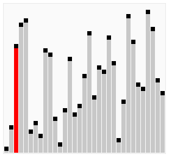

# Algorithms and Data Structures Cheat Sheet

An algorithm is a set of steps for solving a specific problem, while a data structure is a method for organizing and storing data in a computer so that it can be accessed and modified efficiently. This cheat sheet provides a summary of key concepts and techniques in algorithms and data structures, including big O notation, common data structures such as arrays, linked lists, and hash tables, and popular algorithms such as search and sorting algorithms. Understanding these concepts is essential for designing and implementing efficient software solutions.

## Big O Notation

Big O notation is a way to describe the efficiency or complexity of an algorithm. It provides a rough estimate of how long an algorithm will take to run, based on the size of the input data.

In computer science, the "O" in Big O notation is used to describe the upper bound of an algorithm's running time. For example, if an algorithm has a running time of O(n), it means that the algorithm's running time grows at most linearly with the size of the input data. This means that if the input size doubles, the running time of the algorithm will approximately double as well.

There are several common complexities that are described using Big O notation, including:

-   `O(1)`: Constant time. The running time of the algorithm is independent of the size of the input data.

-   `O(log n)`: Logarithmic time. The running time increases logarithmically with the size of the input data.

-   `O(n)`: Linear time. The running time increases linearly with the size of the input data.

-   `O(n log n)`: Log-linear time. The running time increases logarithmically with the size of the input data, but with a smaller coefficient than `O(log n)`.

-   `O(n^2)`: Quadratic time. The running time increases as the square of the size of the input data.

-   `O(n^3)`: Cubic time. The running time increases as the cube of the size of the input data.

-   `O(2^n)`: Exponential time. The running time increases exponentially with the size of the input data.

Big O notation is useful for comparing the efficiency of different algorithms, as well as for predicting the performance of an algorithm on larger inputs. However, it is important to note that Big O notation only provides an upper bound on an algorithm's running time, and actual running times may be faster in practice.

Following chart is a comparison of the common complexities, from fastest to slowest:


Here are some examples of Big O complexities:

`O(n)`:

```ts
function addUpToSimple(n: number): void {
    let total = 0;
    for (let i = 0; i < n; i++) {
        total += i;
    }

    return total;
}
```

The time complexity of the `addUpToSimple` function is O(n). This is because the function has a loop that iterates over all the values from 0 to n, and the time it takes to complete the function grows linearly with the value of n.

`O(1)`:

```ts
function addUpComplex(n: number): void {
    return (n * (n + 1)) / 2;
}
```

The time complexity of the `addUpComplex` function is O(1). This is because the function does not have any loops, and the time it takes to complete the function does not depend on the value of n.

`O(n)`:

```ts
function printUpAndDown(n: number): void {
    console.log("Going up");
    for (let i = 0; i < n; i++) {
        console.log(i);
    }

    console.log("Going down");
    for (let j = n - 1; j > 0; j--) {
        console.log(j);
    }
}
```

The time complexity of the `printUpAndDown` function is O(n). This is because the function has two loops that each iterate over all the values from 0 to n, and the time it takes to complete the function grows linearly with the value of n.
It's possible to think of the complexity as O(2n), but it's important to remember that Big O notation is a way of expressing the general trend of the time complexity of a function, rather than a precise measure. In other words, we are not concerned with the exact number of operations that the function performs, but rather the general trend of how the time complexity increases as the input size grows.

`O(n^2)`:

```ts
function printAllPairs(n: number): void {
    for (let i = 0; i < n; i++) {
        console.log(i);
        for (let j = 0; j < n; j++) {
            console.log(j);
        }
    }
}
```

The time complexity of the `printAllPairs` function is O(n^2). This is because the function has a nested loop, with the inner loop iterating over all the values from 0 to n for each iteration of the outer loop. The time it takes to complete the function grows quadratically with the value of n.

`O(n)`:

```ts
function logAtLeastFive(n: number): void {
    for (let i = 0; i <= Math.max(5, n); i++) {
        console.log(i);
    }
}
```

The time complexity of the `logAtLeastFive` function is O(n). This is because the function has a loop that iterates over all the values from 0 to n, and the time it takes to complete the function grows linearly with the value of n.

`O(1)`:

```ts
function logAtMostFive(n: number): void {
    for (let i = 0; i <= Math.min(5, n); i++) {
        console.log(i);
    }
}
```

The time complexity of the `logAtMostFive` function is O(1). This is because the function has a loop that iterates over a maximum of 5 values, regardless of the value of n. The time it takes to complete the function does not depend on the value of n.

## Big O Notation for some of the Objects and Arrays methods

For the Objects, the `Object.keys`, `Object.values`, and `Object.entries` methods are used to retrieve the keys, values, and key-value pairs, respectively, of the object. These methods have a space complexity of O(n), because they iterate over all the properties of the object and create a new array that is the same size as the number of properties in the object.

The `hasOwnProperty` method, on the other hand, has a space complexity of O(1), because it only performs a single operation (checking whether the object has a property with a specific name). The size of the object does not affect the amount of memory required by the method, so the space complexity is constant.

```ts
const person = { name: "John", age: 22, hobbies: ["reading", "sleeping"] };

Object.keys(person); // ["name", "age", "hobbies"]
Object.values(person); // ["John", 22, ["reading", "sleeping"]]
Object.entries(person); // [["name", "John"], ["age", 22], ["hobbies", ["reading", "sleeping"]]]
person.hasOwnProperty("name"); // true
```

In terms of arrays, the `push` and `pop` methods are generally faster than the `unshift` and `shift` methods when inserting or removing elements from the beginning of an array. This is because inserting or removing elements from the beginning of an array requires re-indexing all the elements in the array, which can be time-consuming. The push and pop methods, on the other hand, only require re-indexing the last element in the array, which is generally faster. However, the exact performance difference between these methods will depend on the specific implementation and the size of the array.

```ts
const array = [1, 2, 3, 4, 5];

console.time("push");
array.push(6);
console.timeEnd("push"); // takes a very small amount of time

console.time("unshift");
array.unshift(0);
console.timeEnd("unshift"); // takes a longer amount of time
```

## Space Complexity

In computer science, space complexity refers to the amount of memory that an algorithm requires to run to completion. It is a measure of the resources that an algorithm consumes, and it is typically expressed in terms of the size of the input to the algorithm.

For example, if an algorithm has a space complexity of O(1), this means that it requires a constant amount of memory, regardless of the size of the input. On the other hand, if an algorithm has a space complexity of O(n), this means that it requires a larger amount of memory as the size of the input increases.

Most primitive data types (booleans, numbers, undefined, and null) are considered to have a constant space complexity. This means that they do not consume more memory as the size of the input increases.

On the other hand, strings and reference types like objects and arrays are considered to have a space complexity of O(n). This means that they consume more memory as the size of the input increases. For strings, the size of the input is the length of the string. For objects and arrays, the size of the input is the number of keys or elements in the object or array.

It is important to note that space complexity is a measure of the resources that an algorithm consumes, and it does not take into account the resources that are required to store the input data. For example, if an algorithm has a space complexity of O(1) but the input data has a space complexity of O(n), the overall space complexity of the algorithm will still be O(n).

Here are some examples of space complexity:

`O(1)`:

```ts
function sum(arr: number[]): number[] {
    let total = 0;
    for (let i = 0; i < arr.length; i++) {
        total += arr[i];
    }
}
```

The space complexity of the function, `sum`, is O(1), because it only uses a single variable (`total`) to store the result of the computation. The size of the input (the length of the array arr) does not affect the amount of memory required by the function, so the space complexity is constant.

`O(n)`:

```ts
function double(arr: number[]): number[] {
    const newArr = [];
    for (let i = 0; i < arr.length; i++) {
        array.push(arr[i] * 2);
    }

    return newArr;
}
```

The space complexity of the function, `double`, is O(n), because it creates a new array (`newArr`) and stores one element in the array for each element in the input array `arr`. The size of the input (the length of the array `arr`) directly determines the number of elements that are stored in the new array, so the space complexity is proportional to the size of the input.

## Common Problem Solving Patterns

Some common problem solving patterns are:

-   Frequency Counter
-   Multiple Pointers
-   Sliding Window
-   Divide and Conquer
-   Recursion

These patterns involve creating and manipulating data structures and algorithms to solve problems more efficiently and effectively. They are often used in interviews and technical assessments as a way to test a candidate's problem solving skills.

### Frequency Counter

Frequency counter is a technique used in algorithm design to count the frequency of elements in a data structure. It is often used to optimize the performance of an algorithm by avoiding the use of costly operations such as searching or sorting.

To implement a frequency counter, you can create an object or map to store the frequencies of the elements in the data structure. You can then iterate through the data structure and increment the count for each element in the object or map.

For example, consider the following array:

```json
[1, 2, 3, 2, 3, 1, 3]
```

To implement a frequency counter for this array, you can create an object with keys representing the elements in the array and values representing their frequencies:

```json
{
    "1": 2,
    "2": 2,
    "3": 3
}
```

You can then use this object to quickly look up the frequency of any element in the array without having to iterate through the entire array. This can be particularly useful when the array is large or when you need to perform multiple lookups.

Frequency counters are often used in conjunction with other techniques such as multiple pointers or sliding windows to solve problems efficiently.

For example here's a problem that could be resolved using the frequency counter pattern:

Write a function `same` that takes in two arrays of numbers `arrOne` and `arrTwo`. The function should return a boolean indicating whether or not the elements in `arrOne` are the squares of the elements in `arrTwo`.

**Without** Frequency Counter:

```ts
function same(arrOne: number[], arrTwo: number[]): boolean {
    // Return false if the arrays have different lengths
    if (arrOne.length !== arrTwo.length) {
        return false;
    }

    // Iterate through each element in arrOne
    for (let element of arrOne) {
        // Return false if the square of the element is not in arrTwo
        if (!arrTwo.includes(element ** 2)) {
            return false;
        }
        // Remove the element from arrTwo if it is present
        arrTwo.splice(arrTwo.indexOf(element ** 2), 1);
    }

    // If all elements are present and the lengths match, return true
    return true;
}
```

The function has a time complexity of O(n^2). This is because it includes two nested loops. The outer loop iterates through each element of arrOne, and the inner loop searches for the corresponding element in `arrTwo` using the includes method, which has a time complexity of O(n). The splice method, which is also used in the inner loop, has a time complexity of O(n) as well. Therefore, the overall time complexity of the first function is O(n^2).

**With** Frequency Counter:

```ts
function same(arr1: number[], arr2: number[]): boolean {
    // Return false if the arrays have different lengths
    if (arr1.length !== arr2.length) {
        return false;
    }

    // Initialize empty frequency counter objects for arr1 and arr2
    const frequencyCounter1 = {};
    const frequencyCounter2 = {};

    // Populate frequencyCounter1 with the frequency of each element in arr1
    for (let val of arr1) {
        frequencyCounter1[val] = (frequencyCounter1[val] || 0) + 1;
    }
    // Populate frequencyCounter2 with the frequency of each element in arr2
    for (let val of arr2) {
        frequencyCounter2[val] = (frequencyCounter2[val] || 0) + 1;
    }

    // Iterate through the keys in frequencyCounter1
    for (let key in frequencyCounter1) {
        // Calculate the square of the key
        const sqrtKey = parseInt(key, 10) ** 2;
        // Return false if the square of the key is not in frequencyCounter2 or if the frequencies do not match
        if (
            !(sqrtKey in frequencyCounter2) ||
            frequencyCounter2[sqrtKey] !== frequencyCounter1[key]
        ) {
            return false;
        }
    }

    // If all checks pass, return true
    return true;
}
```

The function has a time complexity of O(n). This is because it only includes a single loop through each of the arrays. The `frequencyCounter1` and `frequencyCounter2` objects are built in O(n) time by iterating through `arr1` and `arr2` respectively and adding each element to the corresponding object. Then, the function iterates through the keys in `frequencyCounter1` and checks the corresponding values in `frequencyCounter2`. Since there are a constant number of keys in frequencyCounter1, the time complexity of this step is O(1). Therefore, the overall time complexity of the second function is O(n).

Another example with frequency counter:

Write a function `validAnagram` that takes in two strings, `str1` and `str2`, and returns a boolean indicating whether or not `str1` is an anagram of `str2`. An anagram is a word or phrase formed by rearranging the letters of a different word or phrase, typically using all the original letters exactly once.

```ts
function validAnagram(str1: string, str2: string): boolean {
    // Return false if the strings have different lengths
    if (str1.length !== str2.length) {
        return false;
    }

    // Initialize empty frequency count objects for str1 and str2
    const frequencyCount1 = {};
    const frequencyCount2 = {};

    // Populate frequencyCount1 with the frequency of each character in str1
    for (let value of str1) {
        frequencyCount1[value] = (frequencyCount1[value] || 0) + 1;
    }
    // Populate frequencyCount2 with the frequency of each character in str2
    for (let value of str2) {
        frequencyCount2[value] = (frequencyCount2[value] || 0) + 1;
    }

    // Iterate through each key in frequencyCount1
    for (let key in frequencyCount1) {
        // Return false if the value of the key is different in frequency counters
        if (frequencyCount1[key] !== frequencyCount2[key]) {
            return false;
        }
    }

    // If all characters in str2 are present in the frequency count object and the counts match, return true
    return true;
}
```

The function has a time complexity of O(n). This is because it includes two loops that each iterate through the characters in the strings. The `frequencyCount1` and `frequencyCount2` objects are built in O(n) time by iterating through `str1` and `str2` respectively and adding each character to the corresponding object. Then, the function iterates through the keys in `frequencyCount1` and checks the corresponding values in `frequencyCount2`. Since there are a constant number of keys in `frequencyCount1`, the time complexity of this step is O(1). Therefore, the overall time complexity of the first function is O(n).

Another approach to solve this problem:

```ts
function validAnagram(str1: string, str2: string): boolean {
    // Return false if the strings have different lengths
    if (str1.length !== str2.length) {
        return false;
    }

    // Initialize an empty frequency count object
    const frequencyCount = {};

    // Iterate through each character in str1
    for (let i = 0; i < str1.length; i++) {
        const currentElement = str1[i];
        // Increment the frequency count for the current character in the frequency count object
        frequencyCount[currentElement]
            ? (frequencyCount[currentElement] += 1)
            : (frequencyCount[currentElement] = 1);
    }

    // Iterate through each character in str2
    for (let i = 0; i < str2.length; i++) {
        const currentElement = str2[i];
        // Return false if the current character is not in the frequency count object
        if (!frequencyCount[currentElement]) {
            return false;
        }
        // Decrement the frequency count for the current character in the frequency count object
        else {
            frequencyCount[currentElement] -= 1;
        }
    }

    // If all characters in str2 are present in the frequency count object and the counts match, return true
    return true;
}
```

The function also has a time complexity of O(n). This is because it includes two loops that each iterate through the characters in the strings. The `frequencyCount` object is built in O(n) time by iterating through `str1` and adding each character to the object. Then, the function iterates through `str2` and decrements the count for each character in the `frequencyCount` object. Since the function only iterates through the characters in `str2`, the time complexity is O(n).

## Multiple Pointers

The multiple pointers pattern involves using two or more pointers to solve a problem by traversing a data structure, such as an array or a linked list. The pointers typically move towards each other or towards the middle of the data structure, and the algorithm performs some operation on the values at the pointers' current positions.

Here's an example of how the multiple pointers pattern can be used to solve a problem:

Suppose we want to find the first pair of elements in an array that sums to a target value. We could use the multiple pointers pattern to solve this problem as follows:

1. Initialize two pointers, `left` and `right`, to the first and last elements of the array, respectively.
2. While `left` is less than or equal to `right`, do the following:
    1. If the sum of the elements at `left` and `right` is less than the target value, increment `left`.
    2. If the sum of the elements at `left` and `right` is greater than the target value, decrement `right`.
    3. If the sum of the elements at `left` and `right` is equal to the target value, return the pair (`left`, `right`).
3. If the loop terminates without finding a pair that sums to the target value, return null or some other sentinel value indicating that no such pair was found.
   Using the multiple pointers pattern can be an efficient way to solve certain problems, as it allows us to traverse the data structure in a single pass, rather than needing to perform multiple passes or use nested loops. It can also make the solution more readable and easier to understand, as it clearly defines the roles of the different pointers and the logic of the algorithm.

For example here's a problem that could be resolved using the multiple pointers pattern:

Write a function `sumZero` that takes in an **sorted** array of integers `arr` and returns the first pair of elements that sum to zero, if one exists. If no such pair is found, the function should return an empty array.

**Without** Multiple Pointers:

```ts
function sumZero(arr: number[]): number[] {
    // Iterate over each element in the array
    for (let i = 0; i < arr.length; i++) {
        // Iterate over the remaining elements in the array, starting at the element after i
        for (let j = i + 1; j < arr.length; j++) {
            // If the sum of the current elements is 0, return the pair
            if (arr[i] + arr[j] === 0) {
                return [arr[i], arr[j]];
            }
        }
    }

    // If no pair was found, return an empty array
    return [];
}
```

The time complexity of the `sumZero` function is O(n^2), or quadratic. This is because the function contains a nested loop, and the inner loop iterates over all elements of the array for each iteration of the outer loop. This means that the total number of iterations of the inner loop is equal to the length of the array multiplied by itself, or n \* n.

For example, if the length of the array is 5, the inner loop will be executed 5 \* 5 = 25 times. As the length of the array increases, the time complexity of the function will increase significantly, making it less efficient for larger inputs.

To improve the time complexity of this function, we could try using a different algorithm or data structure, such as the multiple pointers pattern, which has a time complexity of O(n) (linear) for this particular problem.

**With** Multiple Pointers:

```ts
function sumZero(arr: number[]): number[] {
    // Initialize left pointer to the first element of the array
    let left = 0;
    // Initialize right pointer to the last element of the array
    let right = arr.length - 1;

    // While the left pointer is less than the right pointer, do the following:
    while (left < right) {
        // Calculate the sum of the elements at the left and right pointers
        const sum = arr[left] + arr[right];
        // If the sum is 0, return the pair
        if (sum === 0) {
            return [arr[left], arr[right]];
        }
        // If the sum is greater than 0, decrement the right pointer
        else if (sum > 0) {
            right--;
        }
        // If the sum is less than 0, increment the left pointer
        else {
            left++;
        }
    }

    // If no pair was found, return an empty array
    return [];
}
```

The time complexity of the `sumZero` function is O(n), or linear. This is because the function traverses the input array only once, using two pointers that move towards each other until they meet or pass each other. The number of iterations of the loop is directly proportional to the length of the array, so the time complexity is linear.

This is a significant improvement over the previous version of the `sumZero` function, which had a time complexity of O(n^2) (quadratic) due to the nested loop. Using the multiple pointers pattern allowed us to solve the problem with a single pass through the array, making the solution more efficient for larger inputs.

```ts
// my approach

function countUniqueValues(arr: number[]): number {
    let pointer = 0;
    let count = 0;
    while (pointer < arr.length) {
        if (arr[pointer] === arr[pointer + 1]) {
            pointer++;
        } else {
            count++;
            pointer++;
        }
    }

    return count;
}

// steele approach

function countUniqueValues(arr: number[]): number {
    if (arr.length === 0) {
        return 0;
    }

    let i = 0;

    for (let j = 1; j < arr.length; j++) {
        if (arr[i] !== arr[j]) {
            i++;
            arr[i] = arr[j];
        }
    }
    return i + 1;
}
```

### sliding window

O(n^2)

```typescript
function maxSubArraySum(arr: number[], n: number): number | null {
    if (arr.length < n) {
        return null;
    }

    let max = -Infinity;

    for (let i = 0; i < arr.length - n + 1; i++) {
        let tmp = 0;
        for (let j = 0; j < n; j++) {
            tmp += arr[i + j];
        }

        if (tmp > max) {
            max = tmp;
        }
    }
    return max;
}
```

O(n)

sliding window:

```typescript
function maxSubArraySum(arr: number[], n: number): number | null {
    if (arr.length < n) {
        return null;
    }

    let maxSum = 0;
    let tmpSum = 0;

    for (let i = 0; i < n; i++) {
        maxSum += arr[i];
    }

    tmpSum = maxSum;

    for (let i = n; i < arr.length; i++) {
        tmpSum = tmpSum - arr[i - n] + arr[i];
        maxSum = Math.max(tmpSum, maxSum);
    }
    return maxSum;
}
```

### divide and conquer

Linear search

O(n)

```typescript
function linearSearch(arr, val): number {
    for (let i = 0; i < arr.length; i++) {
        if (arr[i] === val) {
            return i;
        }
    }
    return -1;
}
```

divide and conquer:

binarySearch

O (Log n)

```typescript
function binarySearch(sortedArr: number[], value: number): number {
    let min = 0;
    let max = sortedArr.length - 1;

    while (min <= max) {
        let middle = Math.floor((min + max) / 2);
        if (sortedArr[middle] < value) {
            min = middle + 1;
        } else if (sortedArr[middle] > value) {
            max = middle - 1;
        } else {
            return middle;
        }
    }
    return -1;
}
```

## Recursion

a process that calls itself

quick note around call stack

```typescript
function wakeUp() {
    // callStack [wakeUp]
    takeShower();
    eatBreakfast();
    console.log("Ready to go ... ");
} // callStack []

function takeShower() {
    // callStack [takeShower, wakeUp]
    console.log("taking shower");
} // callStack[wakeUp]

function eatBreakfast() {
    // callStack [eatBreakfast, wakeUp]
    const meal = cookBreakFast();
    console.log(`eating ${meal}`);
} // callStack [wakeUp]

function cookBreakFast() {
    // callStack [cookBreakFast, eatBreakfast, wakeUp]
    const meals = ["Cheese", "Protein Shake", "Coffee"];
    return meals[Math.floor(Math.random() * meals.length)]; // callStack [eatBreakFast, wakeUp]
}

wakeUp();
```

two essential part of recursive functions

-   base case: end of the line
-   different input: recursive should call by a different piece of data

```typescript
function sumRange(num: number) {
    if (num === 1) return 1;
    return num + sumRange(num - 1);
}

function factorial(num: number) {
    if (num === 1) return 1;
    return num * factorial(num - 1);
}
```

helper method recursion vs pure recursion

```typescript
// helper method recursion approach
function collectOdd(arr: number[]) {
    const result = [];

    function helper(helperArr: number[]) {
        if (!helperArr.length) {
            return;
        }

        if (helperArr[0] % 2 !== 0) {
            result.push(helperArr[0]);
        }

        helper(helperArr.slice(1));
    }

    helper(arr);

    return result;
}

// pure recursion approach
function collectOdd(arr: number[]): number[] {
    let result = [];

    if (!arr.length) {
        return result;
    }

    if (arr[0] % 2 !== 0) {
        result.push(arr[0]);
    }

    result = collectOdd(result.concat(arr.slice(1)));
    return result;
}
```

## Searching Algorithms

### linear search

_indexOf() includes() find() findIndex()_ all this methods doing linear search behind the scene

O(n)

```typescript
function linearSearch(arr: number[], value: number): number {
    for (let i = 0; i < arr.length; i++) {
        if (arr[i] === value) {
            return i;
        }
        return -1;
    }
}
```

### binary search

O(Log n)

```typescript
function binarySearch(sortedArr: number[], value: number): number {
    let left = 0;
    let right = sortedArr.length - 1;

    while (left <= right) {
        const middle = Math.round((right + left) / 2);

        if (sortedArr[middle] > value) {
            right = middle - 1;
        } else if (sortedArr[middle] < value) {
            left = middle + 1;
        } else {
            return middle;
        }
    }
    return -1;
}
```

### naive string search

O(n^2)

```typescript
function naiveStringSearch(long: string, pattern: string): number {
    let count = 0;

    for (let i = 0; i < long.length; i++) {
        for (let j = 0; j < pattern.length; j++) {
            if (pattern[j] !== long[i + j]) {
                break;
            }
            if (j === pattern.length - 1) {
                count++;
            }
        }
    }

    return count;
}
```

## Sorting Algorithms

### array.sort()

array.sort(cb?) will turn all values to _string_ then sort it based on its _unicode_

```typescript
["a", "c", "b", "f", "d"].sort(); // (5) ["a", "b", "c", "d", "f"]
[1, 10, 6, 8, 2, 3, 5].sort(); //(7) [1, 10, 2, 3, 5, 6, 8]

/* 
also receive callback function by two arguments:
    a: previous number 
    b: next number 

*/
// if callback return NEGATIVE number a will placed before b
[1, 10, 6, 8, 2, 3, 5].sort((a, b) => a - b); // (7) [1, 2, 3, 5, 6, 8, 10]

// if callback return POSITIVE number a will placed after b
(7)[(1, 2, 3, 5, 6, 8, 10)].sort((a, b) => b - a); // (7) [10, 8, 6, 5, 3, 2, 1]

// if callback return ZERO a and b will be placed, at the same position
```

## Quadric

### bubble sort



general: O(n^2)
nearlySortedData: O(n)

```typescript
function bubbleSort(arr: number[]): number[] {
    for (let i = 0; i < arr.length; i++) {
        let noSwap = true;
        for (let j = 0; j < arr.length - i; j++) {
            if (arr[j] > arr[j + 1]) {
                [arr[j], arr[j + 1]] = [arr[j + 1], arr[j]];
                noSwap = false;
            }
        }
        if (noSwap) break;
    }
    return arr;
}

// or

function bubbleSort(arr: number[]): number[] {
    for (let i = arr.length; i > 0; i--) {
        let noSwap = true;
        for (let j = 0; j < i - 1; j++) {
            if (arr[j] > arr[j + 1]) {
                [arr[j], arr[j + 1]] = [arr[j + 1], arr[j]];
                noSwap = false;
            }
        }
        if (noSwap) break;
    }
    return arr;
}
```

### selection sort


O(n^2)

```typescript
function selectionSort(arr: number[]) {
    for (let i = 0; i < arr.length; i++) {
        let min = i;
        for (let j = i + 1; j < arr.length; j++) {
            if (arr[j] < arr[min]) {
                min = j;
            }
        }
        if (min !== i) {
            [arr[i], arr[min]] = [arr[min], arr[i]];
        }
    }
    return arr;
}
```

### insertion sort


general: O(n^2)
nearlySortedData: O(n)

```typescript
function insertionSort(arr) {
    var currentVal;
    for (let i = 1; i < arr.length; i++) {
        currentVal = arr[i];
        for (var j = i - 1; j >= 0 && arr[j] > currentVal; j--) {
            arr[j + 1] = arr[j];
        }
        arr[j + 1] = currentVal;
    }
    return arr;
}
```

### quadric sorting algorithms comparison

|   Algorithm    | Time Complexity (Best) | Time Complexity (Average) | Time Complexity (worst) | Space Complexity |
| :------------: | :--------------------: | :-----------------------: | :---------------------: | :--------------: |
|  bubble sort   |          O(n)          |          O(n^2)           |         O(n^2)          |       O(1)       |
| insertion sort |          O(n)          |          O(n^2)           |         O(n^2)          |       O(1)       |
| selection sort |         O(n^2)         |          O(n^2)           |         O(n^2)          |       O(1)       |

## Fancy

### merge sort


O(n Log n)

```typescript
// merge two sorted array
function merge(arr1: number[], arr2: number[]): number[] {
    let result = [];
    let i = 0;
    let j = 0;

    while (i < arr1.length && j < arr2.length) {
        if (arr1[i] < arr2[j]) {
            result.push(arr1[i]);
            i++;
        } else {
            result.push(arr2[j]);
            j++;
        }
    }

    while (i < arr1.length) {
        result.push(arr1[i]);
        i++;
    }
    while (j < arr2.length) {
        result.push(arr2[j]);
        j++;
    }

    return result;
}

function mergeSort(arr: number[]): number[] {
    if (arr.length <= 1) return arr;

    const middle = Math.floor(arr.length / 2);

    const left = mergeSort(arr.slice(0, middle));
    const right = mergeSort(arr.slice(middle));

    return merge(left, right);
}
```

### quick sort


in following implementation we always assume _first item_ as pivot

general: O(n Log n)
sorted: O(n^2)

```typescript
// place pivot in the right index and return pivot index
function pivot(arr: number[], start = 0, end = arr.length - 1) {
    const pivot = arr[start];
    let pivotIndex = start;

    for (let i = start + 1; i < end; i++) {
        if (arr[i] < pivot) {
            pivotIndex++;
            [arr[pivotIndex], arr[i]] = [arr[i], arr[pivotIndex]];
        }
    }
    [arr[start], arr[pivotIndex]] = [arr[pivotIndex], arr[start]];
}

function quickSort(arr: number[], start = 0, end = arr.length - 1) {
    if (left < right) {
        const pivot = pivot(arr, start, end);

        // left
        quickSort(arr, start, pivotIndex - 1);
        // right
        quickSort(arr, pivotIndex + 1, end);
    }

    return arr;
}
```

### radix sort


O(nk)
n: the number of items we sorting
k: average length of those numbers

```typescript
// get the actual number at the given index
function getDigit(num: number, i: number): number {
    return Math.floor(Math.abs(num) / Math.pow(10, i)) % 10;
}
// get number length
function digitCount(num: number): number {
    if (num === 0) return 1;
    return Math.floor(Math.log10(Math.abs(num))) + 1;
}

// return number by most length
function mostDigits(arr: number[]): number {
    let maxDigits = 0;
    for (let i = 0; i < arr.length; i++) {
        maxDigits = Math.max(maxDigits, digitCount(arr[i]));
    }
    return maxDigits;
}
function radixSort(arr: number[]): number[] {
    let maxDigitCount = mostDigits(arr);
    for (let k = 0; k < maxDigitCount; k++) {
        let digitBuckets = Array.from({ length: 10 }, () => []);
        for (let j = 0; j < arr.length; j++) {
            digitBuckets[getDigit(arr[j], k)].push(arr[j]);
        }

        arr = [].concat(...digitBuckets);
    }
    return arr;
}
```

### fancy sorting algorithms comparison

| Algorithm  | Time Complexity (Best) | Time Complexity (Average) | Time Complexity (worst) | Space Complexity |
| :--------: | :--------------------: | :-----------------------: | :---------------------: | :--------------: |
| merge sort |       O(n Log n)       |        O(n Log n)         |       O(n Log n)        |       O(n)       |
| quick sort |       O(n Log n)       |        O(n Log n)         |         O(n^2)          |     O(Log n)     |
| radix sort |         O(nk)          |           O(nk)           |          O(nk)          |     O(n + k)     |

### Overview comparison


## Data Structure

### complexity comparison

|   DataStructure    | Insertion |                         Removal                          |                 Searching                 | Access |
| :----------------: | :-------: | :------------------------------------------------------: | :---------------------------------------: | :----: |
| Singly Linked List |   O(1)    | bestCase(very beginning): O(1) worstCase(very end): O(n) |                   O(n)                    |  O(n)  |
| Doubly Linked List |   O(1)    |                           O(1)                           | O(n) it is faster than Singly Linked List |  O(n)  |
|       Stack        |   O(1)    |                           O(1)                           |                   O(n)                    |  O(n)  |
|       Queue        |   O(1)    |                           O(1)                           |                   O(n)                    |  O(n)  |
| Binary Search Tree | O( Log n) |                            -                             |                 O(Log n)                  |   -    |
|    Binary Heap     | O( Log n) |                        O( Log n)                         |                  O( n )                   |   -    |
|    Hash Tables     |  O( 1 )   |                          O( 1 )                          |                     -                     | O( 1 ) |

## Singly Linked list

```typescript
class _Node {
    constructor(public value: any) {}
    public next: _Node | null = null;
}

class SinglyLinkedList {
    private _length: number = 0;
    private head: _Node | null = null;
    private tail: _Node | null = null;

    get length() {
        return this._length;
    }

    get print(): null | _Node[] {
        if (!this._length) return null;

        const arr = [];
        let currentNode = this.head;
        while (currentNode) {
            arr.push(currentNode.value);
            currentNode = currentNode.next;
        }
        return arr;
    }

    public push(value: any): SinglyLinkedList {
        const node = new _Node(value);

        if (!this.head || !this.tail) {
            this.head = node;
            this.tail = this.head;
        } else {
            this.tail.next = node;
            this.tail = node;
        }
        this._length += 1;

        return this;
    }

    public pop(): _Node | null {
        if (!this.head) return null;

        let currentNode = this.head;

        if (!currentNode.next) {
            this.head = null;
            this.tail = null;
            this._length -= 1;
            return currentNode;
        }
        while (currentNode.next && currentNode.next.next) {
            currentNode = currentNode.next;
        }
        this.tail = currentNode;
        this.tail.next = null;
        this._length -= 1;
        return currentNode.next as _Node;
    }

    public unShift(value: any): SinglyLinkedList {
        const currentHead = this.head;

        this.head = new _Node(value);

        if (currentHead) {
            this.head.next = currentHead;
        } else {
            this.tail = this.head;
        }
        this._length += 1;
        return this;
    }

    public shift(): _Node | null {
        if (!this.head) return null;

        const currentHead = this.head;
        this.head = currentHead.next;
        this._length -= 1;

        if (currentHead === this.tail) this.tail = null;

        return currentHead;
    }

    public get(index: number): _Node | null {
        if (index < 0 || index >= this._length) return null;

        let currentNode = this.head;
        for (let j = 0; j < index; j++) {
            if (currentNode && currentNode.next) {
                currentNode = currentNode.next;
            }
        }
        return currentNode;
    }

    public set(index: number, value: any): _Node | null {
        const node = this.get(index);
        if (node) {
            node.value = value;
        }
        return node;
    }

    public insert(index: number, value: any): SinglyLinkedList | null {
        if (index < 0 || index >= this._length) {
            return null;
        } else if (index === 0) {
            return this.unShift(value);
        } else if (index === this._length) {
            return this.push(value);
        } else {
            const prevNode = this.get(index - 1);

            if (prevNode) {
                const newNode = new _Node(value);
                newNode.next = prevNode.next;
                prevNode.next = newNode;
                this._length += 1;

                return this;
            }
            return prevNode;
        }
    }

    public remove(index: number): _Node | null {
        if (index === 0) {
            return this.shift();
        } else if (index === this._length - 1) {
            return this.pop();
        } else {
            const prevNode = this.get(index - 1);
            const currentNode = this.get(index);
            if (prevNode && currentNode) {
                prevNode.next = currentNode.next;
                this._length -= 1;
            }
            return currentNode;
        }
    }

    public reverse(): SinglyLinkedList | false {
        if (this._length <= 1) return false;

        let node = this.head;
        this.head = this.tail;
        this.tail = node;

        let next: _Node | null;
        let prev: _Node | null = null;
        for (let i = 0; i < this._length; i++) {
            if (node) {
                next = node.next;
                node.next = prev;
                prev = node;
                node = next;
            }
        }
        return this;
    }
}
```

## Doubly Linked List

```typescript
class _Node {
    public next: _Node | null = null;
    public prev: _Node | null = null;

    constructor(public value: any) {}
}

class DoublyLinkedList {
    private head: _Node | null = null;
    private tail: _Node | null = null;

    private _length = 0;

    get length() {
        return this._length;
    }

    get print(): null | _Node[] {
        if (!this._length) return null;

        const arr = [];
        let currentNode = this.head;
        while (currentNode) {
            arr.push(currentNode.value);
            currentNode = currentNode.next;
        }
        return arr;
    }

    public push(value: any): DoublyLinkedList {
        const node = new _Node(value);

        if (!this.tail) {
            this.head = node;
        } else {
            this.tail.next = node;
            node.prev = this.tail;
        }
        this._length += 1;
        this.tail = node;

        return this;
    }

    public pop(): _Node | null {
        if (!this.tail) {
            return null;
        }

        const currentTail = this.tail;
        if (currentTail.prev) {
            this.tail = currentTail.prev;
            this.tail.next = null;
            currentTail.prev = null;
        } else {
            this.head = null;
            this.tail = null;
        }

        this._length -= 1;
        return currentTail;
    }

    public shift(): null | _Node {
        if (!this.head) {
            return null;
        }

        const currentHead = this.head;
        if (currentHead.next) {
            this.head = currentHead.next;
            this.head.prev = null;
            currentHead.next = null;
        } else {
            return this.pop();
        }

        this._length -= 1;
        return currentHead;
    }

    public unshift(value: any): DoublyLinkedList {
        if (!this.head) {
            return this.push(value);
        }

        const node = new _Node(value);
        const currentHead = this.head;

        this.head = node;
        this.head.next = currentHead;
        currentHead.prev = this.head;

        this._length += 1;
        return this;
    }

    public get(index: number): null | _Node {
        if (index < 0 || index >= this._length) return null;

        let currentNode: _Node | null = null;

        if (index < Math.floor(this._length / 2)) {
            // iterate from head to tail

            currentNode = this.head;
            for (let i = 0; i < index; i++) {
                if (currentNode && currentNode.next) {
                    currentNode = currentNode.next;
                }
            }
        } else {
            // iterate from tail to head

            currentNode = this.tail;
            for (let i = this._length - 1; i > index; i--) {
                if (currentNode && currentNode.prev) {
                    currentNode = currentNode.prev;
                }
                return currentNode;
            }
        }

        return currentNode;
    }

    public set(index: number, value: any): _Node | null {
        const node = this.get(index);
        if (node) {
            node.value = value;
        }
        return node;
    }

    public insert(index: number, value: any): DoublyLinkedList | null {
        if (index < 0 || index > this._length) {
            return null;
        } else if (index === 0) {
            return this.unshift(value);
        } else if (index === this._length) {
            return this.push(value);
        } else {
            const prevNode = this.get(index - 1);
            const nextNode = this.get(index);

            if (prevNode && nextNode) {
                const newNode = new _Node(value);

                prevNode.next = newNode;
                (newNode.prev = prevNode), (newNode.next = nextNode);
                nextNode.prev = newNode;
            }
        }
        this._length += 1;
        return this;
    }

    public remove(index: number): DoublyLinkedList | null {
        if (index < 0 || index > this._length) {
            return null;
        } else if (index === 0) {
            this.shift();
        } else if (index === this._length - 1) {
            this.pop();
        } else {
            const node = this.get(index);

            if (node && node.prev && node.next) {
                (node.prev.next = node.next), (node.next.prev = node.prev);
                (node.next = null), (node.prev = null);
            }
            this._length -= 1;
        }
        return this;
    }
}
```

## Stacks

LIFO
last in first out

```typescript
// implement stack using array
const stack = [1, 2, 3];
stack.push(4); // [1,2,3,4]
stack.pop(); // [1,2,3]
// stacks just have push and pop
stack.unshift(0); // [0,1,2,3]
stack.shift(); // [1,2,3]
```

```typescript
// implementing stack using singly linked list
class _Node {
    public next: _Node | null = null;

    constructor(public value: any) {}
}

class Stack {
    private first: _Node | null = null;
    private last: _Node | null = null;

    private _length = 0;
    get length(): number {
        return this._length;
    }

    push(value: any): Stack {
        const node = new _Node(value);
        const currentFirst = this.first;

        (this.first = node), (this.first.next = currentFirst);

        if (!currentFirst) {
            this.last = node;
        }

        this._length += 1;
        return this;
    }

    pop(): _Node | null {
        const currentFirst = this.first;
        if (currentFirst) {
            if (this.first === this.last) this.last = currentFirst.next;
            this.first = currentFirst.next;
            this._length -= 1;
        }
        return currentFirst;
    }
}
```

## Queue

FIFO
first in first out

```typescript
// implementing queue using array
const q = [];
q.push(1);
q.push(2);
q.shift(1); // out first items first
// or
q.shift(1);
q.shift(2);
q.pop(); // out first items first
```

```typescript
// implementing queue using singly linked list
class _Node {
    public next: _Node | null = null;

    constructor(public value: any) {}
}

class Queue {
    private first: _Node | null = null;
    private last: _Node | null = null;

    private _length = 0;
    get length(): number {
        return this._length;
    }

    enqueue(value: any): Queue {
        const node = new _Node(value);
        if (!this.last) {
            (this.first = node), (this.last = node);
        } else {
            this.last.next = node;
            this.last = node;
        }

        this._length += 1;
        return this;
    }

    dequeue(): _Node | null {
        const currentFirst = this.first;
        if (currentFirst) {
            if (this.first === this.last) this.last = null;
            this.first = currentFirst.next;
            this._length -= 1;
        }

        return currentFirst;
    }
}
```

## Tree

### terminology

-   root: top node of the tree
-   child: a node directly connected to another node when moving away from the root
-   parent: the converse notion of a child
-   sibling: a group of nodes with the same parent
-   leaf: a child with no children
-   edge: connection from two-node

### binary search tree

-   every parent node has at most **two** children
-   every node to the **left** of the parent node is always **less** than the **parent**
-   every node to the **right** of the parent node is always **greater** than the **parent**

```typescript
class _Node {
    constructor(public value: number) {}

    public left: _Node | null = null;
    public right: _Node | null = null;
}
class BinarySearchTree {
    public root: _Node | null = null;

    public insert(value: number): BinarySearchTree | null {
        const node = new _Node(value);
        if (!this.root) {
            this.root = node;
        } else {
            let currentNode: _Node = this.root;
            do {
                if (value === currentNode.value) return null;

                if (value < currentNode.value) {
                    if (currentNode.left) {
                        currentNode = currentNode.left;
                    } else {
                        currentNode.left = node;
                        break;
                    }
                } else {
                    if (currentNode.right) {
                        currentNode = currentNode.right;
                    } else {
                        currentNode.right = node;
                        break;
                    }
                }
            } while (currentNode);
        }
        return this;
    }

    public have(value: number): boolean {
        let currentNode = this.root;
        while (currentNode) {
            if (value === currentNode.value) {
                return true;
            } else {
                if (value < currentNode.value) {
                    if (currentNode.left) {
                        currentNode = currentNode.left;
                        continue;
                    }
                    break;
                } else {
                    if (currentNode.right) {
                        currentNode = currentNode.right;
                        continue;
                    }
                    break;
                }
            }
        }
        return false;
    }
}
```

### tree traversal

there are two main strategies to traversal a tree: **Breadth-first-search** and **Depth-first-search**

```typescript
class _Node {
    constructor(public value: number) {}

    public left: _Node | null = null;
    public right: _Node | null = null;
}
class BinarySearchTree {
    public root: _Node | null = null;

    public insert(value: number): BinarySearchTree | null {
        const node = new _Node(value);
        if (!this.root) {
            this.root = node;
        } else {
            let currentNode: _Node = this.root;
            do {
                if (value === currentNode.value) return null;

                if (value < currentNode.value) {
                    if (currentNode.left) {
                        currentNode = currentNode.left;
                    } else {
                        currentNode.left = node;
                        break;
                    }
                } else {
                    if (currentNode.right) {
                        currentNode = currentNode.right;
                    } else {
                        currentNode.right = node;
                        break;
                    }
                }
            } while (currentNode);
        }
        return this;
    }

    public have(value: number): boolean {
        let currentNode = this.root;
        while (currentNode) {
            if (value === currentNode.value) {
                return true;
            } else {
                if (value < currentNode.value) {
                    if (currentNode.left) {
                        currentNode = currentNode.left;
                    }
                    break;
                } else {
                    if (currentNode.right) {
                        currentNode = currentNode.right;
                        continue;
                    }
                    break;
                }
            }
        }
        return false;
    }
    /* 
    breadth first search (bfs) : traverse tree horizontally
*/
    public bfs(): _Node[] {
        const visited: _Node[] = [];
        if (this.root) {
            const q: _Node[] = [this.root];
            while (q.length) {
                if (q[0].left) q.push(q[0].left);
                if (q[0].right) q.push(q[0].right);

                visited.push(q[0]), q.shift();
            }
        }
        return visited;
    }
    /*
    depth first search (dfs) : traverse tree vertically
    following contains three dfs searching methods:
    1. preOrder : add node => going to left and add left => going to right and add right 
    2. postOrder : going to left and add left => going to right and add right => going to node and add node 
    3. inOrder : going to the left and add left => add node => going to the right and add right
     */
    public dfsPreOrder(): _Node[] {
        const visited: _Node[] = [];
        if (this.root) {
            (function traverse(node: _Node): void {
                visited.push(node);

                if (node.left) {
                    traverse(node.left);
                }
                if (node.right) {
                    traverse(node.right);
                }
            })(this.root);
        }

        return visited;
    }

    public dfsPostOrder(): _Node[] {
        const visited: _Node[] = [];

        if (this.root) {
            (function traverse(node: _Node): void {
                if (node.left) {
                    traverse(node.left);
                }
                if (node.right) {
                    traverse(node.right);
                }

                visited.push(node);
            })(this.root);
        }
        return visited;
    }

    dfsInOrder(): _Node[] {
        const visited: _Node[] = [];

        if (this.root) {
            (function traverse(node: _Node) {
                if (node.left) {
                    traverse(node.left);
                }

                visited.push(node);
                f;

                if (node.right) {
                    traverse(node.right);
                }
            })(this.root);
        }

        return visited;
    }
}
```

### traversal comparison

**depth-first** _vs_ **breadth-first** : they both **timeComplexity is same** but **spaceComplexity is different** if we got **a wide tree** like this:


**breadth-first take up more space.** cuz we adding more element to queue.

if we got **a depth long tree** like this:


**depth-first take up more space.**

<hr/>

**potentially use cases for dfs variants (_preOder postOrder inOrder_)**
preOrder is useful when we want a clone of the tree.
inOrder is useful when we want data so that it's stored in the tree.

## Binary heaps

### terminology

-   a binary heap is as compact as possible (all the children of each node are as full as they can be and left children and filled out first)
-   each parent has at most two children

**Max Binary Heap**:

-   **parent** nodes are always greater than **child** nodes but there are no guarantees between sibling

**Min Binary Heap**:

-   **child** nodes are always greater than **parent** nodes but there are no guarantees between sibling

### binary heap parent and child relations


```typescript
class MaxBinaryHeap {
    private _values: number[] = [];
    get values(): number[] {
        return this._values;
    }

    private sinkingUp(value: number): void {
        let valueIndex = this._values.length - 1;
        while (valueIndex > 0) {
            const parentIndex = Math.floor((valueIndex - 1) / 2);
            const parent = this._values[parentIndex];

            if (value <= parent) break;

            this._values[parentIndex] = value;
            this._values[valueIndex] = parent;

            valueIndex = parentIndex;
        }
    }
    private sinkingDown(): void {
        let targetIndex = 0;
        while (true) {
            let leftChildIndex = targetIndex * 2 + 1,
                rightChildIndex = targetIndex * 2 + 2;

            let target = this._values[targetIndex],
                leftChild = this._values[leftChildIndex],
                rightChild = this._values[rightChildIndex];

            if (target < leftChild && target < rightChild) {
                if (rightChild > leftChild) {
                    [this._values[targetIndex], this._values[rightChildIndex]] =
                        [
                            this._values[rightChildIndex],
                            this._values[targetIndex],
                        ];

                    targetIndex = rightChildIndex;
                } else {
                    [this._values[targetIndex], this._values[leftChildIndex]] =
                        [
                            this._values[leftChildIndex],
                            this._values[targetIndex],
                        ];

                    targetIndex = leftChildIndex;
                }

                continue;
            } else if (rightChild >= target) {
                [this._values[targetIndex], this._values[rightChildIndex]] = [
                    this._values[rightChildIndex],
                    this._values[targetIndex],
                ];

                targetIndex = leftChildIndex;

                continue;
            } else if (leftChild >= target) {
                [this._values[targetIndex], this._values[leftChildIndex]] = [
                    this._values[leftChildIndex],
                    this._values[targetIndex],
                ];

                targetIndex = leftChildIndex;

                continue;
            }

            break;
        }
    }

    public insert(value: number): number[] {
        this._values.push(value);
        this.sinkingUp(value);
        return this._values;
    }

    public extractMax(): number | null {
        if (!this._values.length) {
            return null;
        }
        const root = this._values[0];
        this._values[0] = this._values[this._values.length - 1];
        this._values.pop();
        this.sinkingDown();

        return root;
    }
}
```

## Priority Queue

A data structure which every element has a priority.
Elements with higher priorities are served before elements with lower priorities.

**In the following example, we implemented a priority queue using minBinaryHeap but you should know binaryHeaps and priority queue is two different concepts and we just use abstract of it**

```typescript
interface INode {
    value: any;
    priority: number;
}

class _Node implements INode {
    constructor(public value: any, public priority: number = 0) {}
}

class PriorityQueue {
    private _values: INode[] = [];
    get values(): INode[] {
        return this._values;
    }

    private sinkingUp(node: INode): void {
        let valueIndex = this._values.length - 1;
        while (valueIndex > 0) {
            const parentIndex = Math.floor((valueIndex - 1) / 2);
            const parent = this._values[parentIndex];

            if (node.priority >= parent.priority) break;

            this._values[parentIndex] = node;
            this._values[valueIndex] = parent;

            valueIndex = parentIndex;
        }
    }
    private sinkingDown(): void {
        let targetIndex = 0;
        while (true) {
            let leftChildIndex = targetIndex * 2 + 1,
                rightChildIndex = targetIndex * 2 + 2;

            let target = this._values[targetIndex],
                leftChild = this._values[leftChildIndex],
                rightChild = this._values[rightChildIndex];

            if (
                leftChild &&
                rightChild &&
                target.priority > leftChild.priority &&
                target.priority > rightChild.priority
            ) {
                if (rightChild.priority < leftChild.priority) {
                    [this._values[targetIndex], this._values[rightChildIndex]] =
                        [
                            this._values[rightChildIndex],
                            this._values[targetIndex],
                        ];

                    targetIndex = rightChildIndex;
                } else {
                    [this._values[targetIndex], this._values[leftChildIndex]] =
                        [
                            this._values[leftChildIndex],
                            this._values[targetIndex],
                        ];

                    targetIndex = leftChildIndex;
                }

                continue;
            } else if (rightChild && rightChild.priority <= target.priority) {
                [this._values[targetIndex], this._values[rightChildIndex]] = [
                    this._values[rightChildIndex],
                    this._values[targetIndex],
                ];

                targetIndex = leftChildIndex;

                continue;
            } else if (leftChild && leftChild.priority <= target.priority) {
                [this._values[targetIndex], this._values[leftChildIndex]] = [
                    this._values[leftChildIndex],
                    this._values[targetIndex],
                ];

                targetIndex = leftChildIndex;

                continue;
            }

            break;
        }
    }

    public enqueue({ value, priority }: INode): _Node[] {
        const node = new _Node(value, priority);
        this._values.push(node);
        this.sinkingUp(node);
        return this._values;
    }

    public dequeue(): _Node | null {
        if (!this._values.length) {
            return null;
        }
        const root = this._values[0];
        this._values[0] = this._values[this._values.length - 1];
        this._values.pop();
        this.sinkingDown();

        return root;
    }
}
```

## Hash Tables

Hash tables are a collection of key-value pairs

### collisions

There is a possibility for handle collisions in hash tables :

-   Separate chaining ( e.g. using nested arrays of key values _implemented in following hash tables_ )
-   linear probing ( if index filled place {key, value} in next position )

```typescript
type El = [string, any];
class HashTable {
    private keyMap: El[][];
    constructor(size: number = 53) {
        this.keyMap = new Array(size);
    }

    public _hash(key: string): number {
        let total = 0;
        const WEIRD_PRIME = 31;

        for (let i = 0; i < key.length; i++) {
            const characterCode = key.charCodeAt(i) - 96;
            total = (total + characterCode * WEIRD_PRIME) % this.keyMap.length;
        }
        return total;
    }

    set(key: string, value: any): El[][] {
        const index = this._hash(key);
        if (!this.keyMap[index]) {
            this.keyMap[index] = [];
        }

        this.keyMap[index].push([key, value]);

        return this.keyMap;
    }

    get(key: string): El | undefined {
        const index = this._hash(key);

        const elements = this.keyMap[index];

        if (elements) {
            for (let value of elements) {
                if (value[0] === key) return value[1];
            }
        }

        return undefined;
    }

    get keys(): string[] {
        const keys: string[] = [];
        for (let value of this.keyMap) {
            if (value) {
                for (let _value of value) {
                    keys.push(_value[0]);
                }
            }
        }
        return keys;
    }

    get values(): any[] {
        const values = new Set<any>();

        for (let value of this.keyMap) {
            if (value) {
                for (let _value of value) {
                    values.add(value[1]);
                }
            }
        }

        return [...values];
    }
}
```

## Graphs

A graph data structure consists of a finite (and possibly mutable) set of vertices or nodes or points, together with a set of unordered pairs of these vertices for an undirected graph or a set of ordered pairs for a directed graph.

### terminology

-   vertex :node

-   edge: the connection between nodes

-   directed/ undirected graph:
    in the directed graph there is a direction assigned to vertices and in undirected, no direction is assigned.
    

-   weighted/ unweighted graph:
    in a weighted graph,depth-first there is a weight associated with edges but in an unweighted graph no weight assigned to edges
    

### adjacency matrix


## adjacency list


## adjacency list vs adjacency matrix

|   Operation   | Adjacency List | Adjacency Matrix |
| :-----------: | :------------: | :--------------: |
|  Add vertex   |      O(1)      |      O(V^2)      |
|   Add Edge    |      O(1)      |       O(1)       |
| Remove vertex |     O(V+E)     |      O(V^2)      |
|  Remove Edge  |      O(E)      |       O(1)       |
|     Query     |     O(V+E)     |       O(1)       |
|    Storage    |     O(V+E)     |      O(V^2)      |

-   |V| : number of Vertices
-   |E| : number of Edges

<hr/>

-   **Adjacency List** take **less space** in sparse graph( when we have a few edges ).
-   **Adjacency List** are **faster to iterate** over edges.
-   **Adjacency Matrix** are **faster to** finding a specific edge.

### graph(adjacency list)

```typescript
interface AdjacencyList {
    [vertex: string]: string[];
}

class Graph {
    private _adjacencyList: AdjacencyList = {};
    public get adjacencyList(): AdjacencyList {
        return this._adjacencyList;
    }
    public set adjacencyList(value: AdjacencyList) {
        this._adjacencyList = value;
    }

    public addVertex(vertex: string): AdjacencyList {
        this._adjacencyList[vertex] = [];
        return this._adjacencyList;
    }

    public addEdge(vertex1: string, vertex2: string): boolean {
        if (this._adjacencyList[vertex1] && this._adjacencyList[vertex2]) {
            this._adjacencyList[vertex1].push(vertex2),
                this._adjacencyList[vertex2].push(vertex1);

            return true;
        }
        return false;
    }

    public removeEdge(vertex1: string, vertex2: string): boolean {
        if (this._adjacencyList[vertex1] && this._adjacencyList[vertex2]) {
            (this._adjacencyList[vertex1] = this._adjacencyList[vertex1].filter(
                (value: string) => value !== vertex2
            )),
                (this._adjacencyList[vertex2] = this._adjacencyList[
                    vertex2
                ].filter((value: string) => value !== vertex1));
            return true;
        }
        return false;
    }

    public removeVertex(vertex: string): string | undefined {
        if (this._adjacencyList[vertex]) {
            for (let key in this._adjacencyList) {
                this.removeEdge(key, vertex);
            }
            delete this._adjacencyList[vertex];

            return vertex;
        }
        return undefined;
    }
}
```

## Graph Traversal

### depth first traversal and breadth-first traversal in the the graph

```typescript
interface AdjacencyList {
    [vertex: string]: string[];
}

class Graph {
    private _adjacencyList: AdjacencyList = {};
    public get adjacencyList(): AdjacencyList {
        return this._adjacencyList;
    }
    public set adjacencyList(value: AdjacencyList) {
        this._adjacencyList = value;
    }

    public addVertex(vertex: string): AdjacencyList {
        this._adjacencyList[vertex] = [];
        return this._adjacencyList;
    }

    public addEdge(vertex1: string, vertex2: string): boolean {
        if (this._adjacencyList[vertex1] && this._adjacencyList[vertex2]) {
            this._adjacencyList[vertex1].push(vertex2),
                this._adjacencyList[vertex2].push(vertex1);

            return true;
        }
        return false;
    }

    public removeEdge(vertex1: string, vertex2: string): boolean {
        if (this._adjacencyList[vertex1] && this._adjacencyList[vertex2]) {
            (this._adjacencyList[vertex1] = this._adjacencyList[vertex1].filter(
                (value: string) => value !== vertex2
            )),
                (this._adjacencyList[vertex2] = this._adjacencyList[
                    vertex2
                ].filter((value: string) => value !== vertex1));
            return true;
        }
        return false;
    }

    public removeVertex(vertex: string): string | undefined {
        if (this._adjacencyList[vertex]) {
            for (let key in this._adjacencyList) {
                this.removeEdge(key, vertex);
            }
            delete this._adjacencyList[vertex];

            return vertex;
        }
        return undefined;
    }

    public dfcRecursive(startingVertex: string): string[] {
        const results: string[] = [];
        const adjacencyList = this._adjacencyList;

        let currentVertex = this._adjacencyList[startingVertex];
        if (currentVertex) {
            const visitedVertex: { [vertex: string]: boolean } = {};

            (function traverse(vertex: string | undefined): void {
                if (!vertex) return;

                if (!visitedVertex[vertex]) {
                    visitedVertex[vertex] = true;
                    results.push(vertex);

                    for (let neighbor of currentVertex) {
                        if (!visitedVertex[neighbor]) {
                            currentVertex = adjacencyList[neighbor];
                            traverse(neighbor);
                        }
                    }
                }
            })(startingVertex);
        }

        return results;
    }
    // or
    public dfsIterative(startingVertex: string): string[] {
        const results: string[] = [];

        if (this._adjacencyList[startingVertex]) {
            let stack: string[] = [startingVertex];
            const visitedVertex: { [vertex: string]: boolean } = {};

            while (stack.length) {
                const currentVertex = stack.pop();
                if (currentVertex && !visitedVertex[currentVertex]) {
                    visitedVertex[currentVertex] = true;
                    results.push(currentVertex);
                    stack = [...stack, ...this._adjacencyList[currentVertex]];
                }
            }
        }

        return results;
    }

    public breadthFirstSearch(startingVertex: string): string[] {
        const results: string[] = [];

        if (this._adjacencyList[startingVertex]) {
            let queue = [startingVertex];
            const visitedVertex: { [vertex: string]: boolean } = {};

            while (queue.length) {
                const currentVertex = queue.shift();
                if (currentVertex && !visitedVertex[currentVertex]) {
                    visitedVertex[currentVertex] = true;
                    results.push(currentVertex);
                    queue = [...queue, ...this._adjacencyList[currentVertex]];
                }
            }
        }

        return results;
    }
}
```

## Dijkstra's Shortest path first Algorithms

Finding shortest path between two vertices in a **weighted graph**.


```typescript
interface Value {
    value: any;
    priority: number;
}

interface Neighbor {
    vertex: string;
    weight: number;
}

interface AdjacencyList {
    [vertex: string]: Neighbor[];
}

// naive priority queue
class PriorityQueue {
    private _values: Value[] = [];
    public get values(): Value[] {
        return this._values;
    }

    public enqueue(value: any, priority: number): Value[] {
        this._values.push({ value, priority });
        this.sort();
        return this._values;
    }

    public dequeue(): Value {
        const value = this._values.shift();
        return value as Value;
    }

    private sort() {
        this._values.sort((a: Value, b: Value) => a.priority - b.priority);
    }
}

class WeightedGraph {
    private _adjacencyList: AdjacencyList = {};
    public get adjacencyList(): AdjacencyList {
        return this._adjacencyList;
    }
    public set adjacencyList(value: AdjacencyList) {
        this._adjacencyList = value;
    }

    public addVertex(vertex: string): AdjacencyList {
        this._adjacencyList[vertex] = [];
        return this._adjacencyList;
    }

    public addEdge(vertex1: string, vertex2: string, weight: number): boolean {
        if (this._adjacencyList[vertex1]) {
            this._adjacencyList[vertex1].push({ vertex: vertex2, weight });
            this._adjacencyList[vertex2].push({ vertex: vertex1, weight });
            return true;
        }
        return false;
    }

    /* 
    Dijkstra’scomplex problemsthem shortest path first
    */

    dijkstraSPF(startingVertex: string, targetVertex: string): string[] {
        let path: string[] = [];

        if (
            this._adjacencyList[startingVertex] &&
            this._adjacencyList[targetVertex]
        ) {
            const pq = new PriorityQueue();
            const previousVertex: { [vertex: string]: string | null } = {};
            const distances: { [vertex: string]: number } = {};

            // build initial states
            for (let key in this._adjacencyList) {
                if (key === startingVertex) {
                    (distances[key] = 0), pq.enqueue(key, 0);
                } else {
                    distances[key] = Infinity;
                    pq.enqueue(key, Infinity);
                }
                previousVertex[key] = null;
            }

            while (pq.values.length) {
                let smallest = pq.dequeue().value;
                if (smallest) {
                    if (smallest === targetVertex) {
                        // done build path
                        while (
                            previousVertex[smallest] ||
                            smallest === startingVertex
                        ) {
                            path.push(smallest);
                            smallest = previousVertex[smallest];
                        }
                        break;
                    }

                    for (let neighbor of this._adjacencyList[smallest]) {
                        const candidate = distances[smallest] + neighbor.weight;

                        let nextNeighbor = neighbor.vertex;

                        if (candidate < distances[nextNeighbor]) {
                            distances[nextNeighbor] = candidate;

                            previousVertex[nextNeighbor] = smallest;

                            pq.enqueue(nextNeighbor, candidate);
                        }
                    }
                }
            }
        }

        return path.reverse();
    }
}
```

## Dynamic Programming (light introduction)

It's a method for solving a complex problems by breaking it down into a collection of simpler problems, solving their subProblems **once** and **storing** their solutions.
_technically it using knowledge of last problems to solve next by memorization_

### example Fibonacci sequence

Let's implement it without dynamic programming:without dynamic programming:

**_in fibonacci sequence fib(n) = fib(n-2) + fib(n-1) && fin(1) = 1 && fib(2) = 1_**

**O(2^n)**

```typescript
function fib(n: number): number {
    if (n <= 2) return 1;
    return fib(n - 1) + fib(n - 2);
}
```


As you see we calculate f(5) two times with current implementation.

### memorization

Storing the expensive function class results and returning the cached result when the same inputs occur again.

O(n)

```typescript
function fib(n: number, memo: number[] = []): number {
    if (memo[n]) return memo[n];

    if (n <= 2) return 1;

    const res = fib(n - 1, memo) + fib(n - 2, memo);
    memo[n] = res;

    return res;
}
fib(10000); // Maximum callStack exceeded
```

### tabulation

```typescript
function fib(n: number): number {
    if (n <= 2) return 1;

    const fibNumbers = [0, 1, 1];

    for (let index = 3; index <= n; index++) {
        fibNumbers[index] = fibNumbers[index - 1] + fibNumbers[index - 2];
    }

    console.log(fibNumbers);

    return fibNumbers[n];
}
fib(10000); // Infinity
```

## Interesting Stuff

```typescript
// turn it to boolean
console.log(!!1); // true
console.log(!!0); // false

// group operation
(newNode.prev = prevNode), (newNode.next = nextNode);
```

## String

```typescript
const str = "hello";
str.search('lo') || .indexOf('lo') // 3
str.includes('lo') // true
```

### string pattern matching

```typescript
// regex.test(str: number) Returns a Boolean value that indicates whether or not a pattern exists in a searched string.
function charCount(str: string) {
    const result: { [key: string]: number } = {};

    for (let char of str) {
        char = char.toLowerCase();
        if (/[a-z0-9]/.test(char)) {
            result[char] = ++result[char] || 1;
        }
    }

    return result;
}

// *** string.chatCodeAt(i: number) Returns the unicode of value on specified location

/* 
numeric (0-9) code > 47 && code < 58;
upper alpha (A-Z) code > 64 && code < 91;
lower alpha (a-z) code > 96 && code <123;
*/
function charCount(str: string) {
    const result: { [key: string]: number } = {};

    for (let char of str) {
        if (isAlphaNumeric(char)) {
            char = char.toLowerCase();
            result[char] = ++result[char] || 1;
        }
    }

    return result;
}

function isAlphaNumeric(char: string) {
    const code = char.charCodeAt(0);
    if (
        !(code > 47 && code < 58) &&
        !(code > 64 && code < 91) &&
        !(code > 96 && code < 123)
    ) {
        return false;
    }
    return true;
}
```

## Array

```typescript
const array = ["hello", "world"];
arr.find((el) => el === "world"); // world
arr.findIndex((el) => el === "world"); // 1

[1, 2].includes(1); // true

Array.from({ length: 2 }, () => ["lol"]); // [["lol"], ["lol"]]

const stack = ["A", "B", "D", "E", "C", "F"];
const s = stack.shift();
const p = stack.pop();
console.log(s); // "A"
console.log(p); // "F"

["a", "b"].reverse(); // ['b', 'a']
```

### Object

```typescript
delete this._adjacencyList[vertex]; // delete key and value from object
delete this._adjacencyList.vertex;
```

### Map

```typescript
const map = new Map();
// store any type of **unique key** of use duplicate key it will override last value
map.set({ 1: "Object" }, "Object");
map.set(["arr"], "arr");
map.set(1, "number");
map.set(false, "boolean");
map.set(() => console.log("Function"), "Function");

console.log(map);
/* 
0: {Object => "Object"}
1: {Array(1) => "arr"}
2: {1 => "number"}
3: {false => "boolean"}
4: {function () { return console.log("Function"); } => "Function"}
*/

// iterable by **for (let [key, value] of map)**
for (let [key, value] of map) console.log(key, value);

// map to arr
const arr = [...map]; // :[ [key, value] ]
/* 
0: (2) [{…}, "Object"]
1: (2) [Array(1), "arr"]
2: (2) [1, "number"]
3: (2) [false, "boolean"]
4: (2) [ƒ, "Function"]
*/
```

## Math

```typescript
Math.pow(2, 2); // 4
Math.abs(-5); // 5
Math.log10(100); // 10
Math.max(...[1, 2, 3]); // 3
Math.min(...[1, 2, 3]); // 1
```
