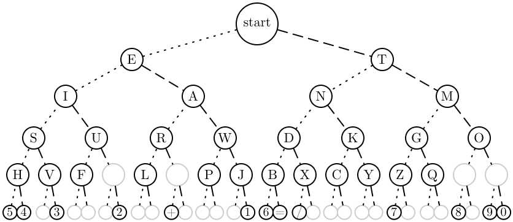
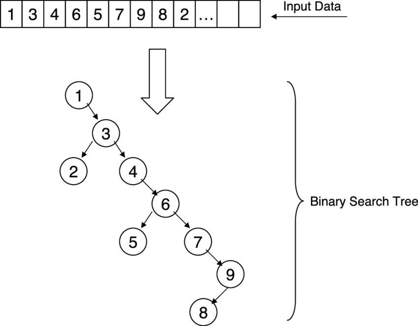
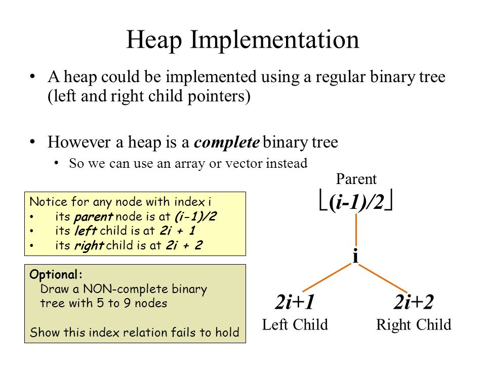
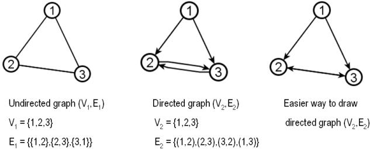
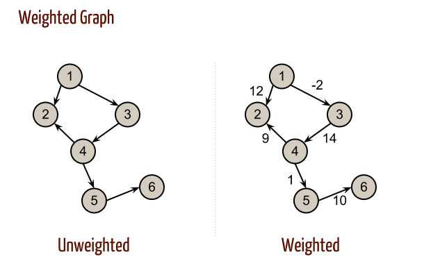
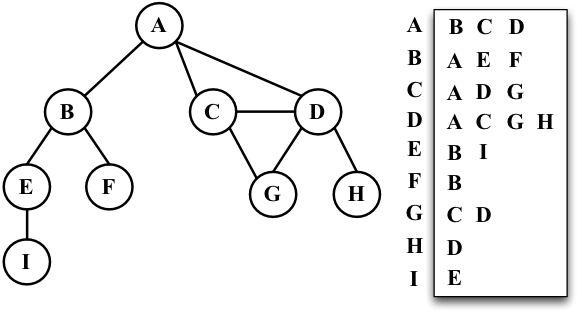

<!-- TOC start (generated with https://github.com/derlin/bitdowntoc) -->

- [Algorithms and Data Structures Cheat Sheet](#algorithms-and-data-structures-cheat-sheet)
  * [Big O Notation](#big-o-notation)
  * [Big O Notation for some of the Objects and Arrays methods](#big-o-notation-for-some-of-the-objects-and-arrays-methods)
  * [Space Complexity](#space-complexity)
  * [Common Problem-Solving Patterns](#common-problem-solving-patterns)
    + [Frequency Counter](#frequency-counter)
  * [Multiple Pointers](#multiple-pointers)
    + [Sliding Window](#sliding-window)
    + [Divide-and-Conquer](#divide-and-conquer)
    + [Recursion](#recursion)
      - [Understanding the Call Stack](#understanding-the-call-stack)
  * [Searching Algorithms](#searching-algorithms)
    + [Linear Search](#linear-search)
  * [Sorting Algorithms](#sorting-algorithms)
    + [Bubble Sort](#bubble-sort)
    + [Selection Sort](#selection-sort)
    + [Insertion Sort](#insertion-sort)
    + [Merge Sort](#merge-sort)
    + [Quick Sort](#quick-sort)
    + [Radix Sort](#radix-sort)
  * [Data Structure](#data-structure)
    + [complexity comparison](#complexity-comparison)
  * [Singly Linked list](#singly-linked-list)
  * [Doubly Linked List](#doubly-linked-list)
  * [Stacks](#stacks)
  * [Queue](#queue)
  * [Tree](#tree)
    + [terminology](#terminology)
    + [binary search tree](#binary-search-tree)
    + [tree traversal](#tree-traversal)
    + [traversal comparison](#traversal-comparison)
  * [Binary heaps](#binary-heaps)
    + [terminology](#terminology-1)
    + [binary heap parent and child relations](#binary-heap-parent-and-child-relations)
  * [Priority Queue](#priority-queue)
  * [Hash Tables](#hash-tables)
    + [collisions](#collisions)
  * [Graphs](#graphs)
    + [terminology](#terminology-2)
    + [adjacency matrix](#adjacency-matrix)
  * [adjacency list](#adjacency-list)
  * [adjacency list vs adjacency matrix](#adjacency-list-vs-adjacency-matrix)
    + [graph(adjacency list)](#graphadjacency-list)
  * [Graph Traversal](#graph-traversal)
    + [depth first traversal and breadth-first traversal in the the graph](#depth-first-traversal-and-breadth-first-traversal-in-the-the-graph)
  * [Dijkstra's Shortest path first Algorithms](#dijkstras-shortest-path-first-algorithms)
  * [Dynamic Programming (light introduction)](#dynamic-programming-light-introduction)
    + [example Fibonacci sequence](#example-fibonacci-sequence)
    + [memorization](#memorization)
    + [tabulation](#tabulation)
  * [Interesting Stuff](#interesting-stuff)
  * [String](#string)
    + [string pattern matching](#string-pattern-matching)
  * [Array](#array)
    + [Object](#object)
    + [Map](#map)
  * [Math](#math)

<!-- TOC end -->

<!-- TOC --><a name="algorithms-and-data-structures-cheat-sheet"></a>
# Algorithms and Data Structures Cheat Sheet

An algorithm is a set of steps for solving a specific problem, while a data structure is a method for organizing and storing data in a computer so that it can be accessed and modified efficiently. This cheat sheet provides a summary of key concepts and techniques in algorithms and data structures, including big O notation, common data structures such as arrays, linked lists, and hash tables, and popular algorithms such as search and sorting algorithms. Understanding these concepts is essential for designing and implementing efficient software solutions.

<!-- TOC --><a name="big-o-notation"></a>
## Big O Notation

Big O notation is a way to describe the efficiency or complexity of an algorithm. It provides a rough estimate of how long an algorithm will take to run, based on the size of the input data.

In computer science, the "O" in Big O notation is used to describe the upper bound of an algorithm's running time. For example, if an algorithm has a running time of O(n), it means that the algorithm's running time grows most linearly with the size of the input data. This means that if the input size doubles, the running time of the algorithm will approximately double as well.

Several common complexities are described using Big O notation, including:

-   `O(1)`: Constant time. The running time of the algorithm is independent of the size of the input data.

-   `O(log n)`: Logarithmic time. The running time increases logarithmically with the size of the input data.

-   `O(n)`: Linear time. The running time increases linearly with the size of the input data.

-   `O(n log n)`: Log-linear time. The running time increases logarithmically with the size of the input data, but with a smaller coefficient than `O(log n)`.

-   `O(n^2)`: Quadratic time. The running time increases as the square of the size of the input data.

-   `O(n^3)`: Cubic time. The running time increases as the cube of the size of the input data.

-   `O(2^n)`: Exponential time. The running time increases exponentially with the size of the input data.

Big O notation is useful for comparing the efficiency of different algorithms, as well as for predicting the performance of an algorithm on larger inputs. However, it is important to note that Big O notation only provides an upper bound on an algorithm's running time, and actual running times may be faster in practice.

The following chart is a comparison of the common complexities, from fastest to slowest:


Here are some examples of Big O complexities:

`O(n)`:

```ts
function addUpToSimple(n: number): void {
    let total = 0;
    for (let i = 0; i < n; i++) {
        total += i;
    }

    return total;
}
```

The time complexity of the `addUpToSimple` function is O(n). This is because the function has a loop that iterates over all the values from 0 to n, and the time it takes to complete the function grows linearly with the value of n.

`O(1)`:

```ts
function addUpComplex(n: number): void {
    return (n * (n + 1)) / 2;
}
```

The time complexity of the `addUpComplex` function is O(1). This is because the function does not have any loops, and the time it takes to complete the function does not depend on the value of n.

`O(n)`:

```ts
function printUpAndDown(n: number): void {
    console.log("Going up");
    for (let i = 0; i < n; i++) {
        console.log(i);
    }

    console.log("Going down");
    for (let j = n - 1; j > 0; j--) {
        console.log(j);
    }
}
```

The time complexity of the `printUpAndDown` function is O(n). This is because the function has two loops that each iterate over all the values from 0 to n, and the time it takes to complete the function grows linearly with the value of n.
It's possible to think of the complexity as O(2n), but it's important to remember that Big O notation is a way of expressing the general trend of the time complexity of a function, rather than a precise measure. In other words, we are not concerned with the exact number of operations that the function performs, but rather the general trend of how the time complexity increases as the input size grow.

`O(n^2)`:

```ts
function printAllPairs(n: number): void {
    for (let i = 0; i < n; i++) {
        console.log(i);
        for (let j = 0; j < n; j++) {
            console.log(j);
        }
    }
}
```

The time complexity of the `printAllPairs` function is O(n^2). This is because the function has a nested loop, with the inner loop iterating over all the values from 0 to n for each iteration of the outer loop. The time it takes to complete the function grows quadratically with the value of n.

`O(n)`:

```ts
function logAtLeastFive(n: number): void {
    for (let i = 0; i <= Math.max(5, n); i++) {
        console.log(i);
    }
}
```

The time complexity of the `logAtLeastFive` function is O(n). This is because the function has a loop that iterates over all the values from 0 to n, and the time it takes to complete the function grows linearly with the value of n.

`O(1)`:

```ts
function logAtMostFive(n: number): void {
    for (let i = 0; i <= Math.min(5, n); i++) {
        console.log(i);
    }
}
```

The time complexity of the `logAtMostFive` function is O(1). This is because the function has a loop that iterates over a maximum of 5 values, regardless of the value of n. The time it takes to complete the function does not depend on the value of n.

<!-- TOC --><a name="big-o-notation-for-some-of-the-objects-and-arrays-methods"></a>
## Big O Notation for some of the Objects and Arrays methods

For the Objects, the `Object.keys`, `Object.values`, and `Object.entries` methods are used to retrieve the keys, values, and key-value pairs, respectively, of the object. These methods have a space complexity of O(n) because they iterate over all the properties of the object and create a new array that is the same size as the number of properties in the object.

The `hasOwnProperty` method, on the other hand, has a space complexity of O(1), because it only performs a single operation (checking whether the object has a property with a specific name). The size of the object does not affect the amount of memory required by the method, so the space complexity is constant.

```ts
const person = { name: "John", age: 22, hobbies: ["reading", "sleeping"] };

Object.keys(person); // ["name", "age", "hobbies"]
Object.values(person); // ["John", 22, ["reading", "sleeping"]]
Object.entries(person); // [["name", "John"], ["age", 22], ["hobbies", ["reading", "sleeping"]]]
person.hasOwnProperty("name"); // true
```

In terms of arrays, the `push` and `pop` methods are generally faster than the `unshift` and `shift` methods when inserting or removing elements from the beginning of an array. This is because inserting or removing elements from the beginning of an array requires re-indexing all the elements in the array, which can be time-consuming. The push and pop methods, on the other hand, only require re-indexing the last element in the array, which is generally faster. However, the exact performance difference between these methods will depend on the specific implementation and the size of the array.

```ts
const array = [1, 2, 3, 4, 5];

console.time("push");
array.push(6);
console.timeEnd("push"); // takes a very small amount of time

console.time("unshift");
array.unshift(0);
console.timeEnd("unshift"); // takes a longer amount of time
```

<!-- TOC --><a name="space-complexity"></a>
## Space Complexity

In computer science, space complexity refers to the amount of memory that an algorithm requires to run to completion. It is a measure of the resources that an algorithm consumes, and it is typically expressed in terms of the size of the input to the algorithm.

For example, if an algorithm has a space complexity of O(1), this means that it requires a constant amount of memory, regardless of the size of the input. On the other hand, if an algorithm has a space complexity of O(n), this means that it requires a larger amount of memory as the size of the input increases.

Most primitive data types (booleans, numbers, undefined, and null) are considered to have a constant space complexity. This means that they do not consume more memory as the size of the input increases.

On the other hand, strings and reference types like objects and arrays are considered to have a space complexity of O(n). This means that they consume more memory as the size of the input increases. For strings, the size of the input is the length of the string. For objects and arrays, the size of the input is the number of keys or elements in the object or array.

It is important to note that space complexity is a measure of the resources that an algorithm consumes, and it does not take into account the resources that are required to store the input data. For example, if an algorithm has a space complexity of O(1) but the input data has a space complexity of O(n), the overall space complexity of the algorithm will still be O(n).

Here are some examples of space complexity:

`O(1)`:

```ts
function sum(arr: number[]): number[] {
    let total = 0;
    for (let i = 0; i < arr.length; i++) {
        total += arr[i];
    }
}
```

The space complexity of the function, `sum`, is O(1) because it only uses a single variable (`total`) to store the result of the computation. The size of the input (the length of the array arr) does not affect the amount of memory required by the function, so the space complexity is constant.

`O(n)`:

```ts
function double(arr: number[]): number[] {
    const newArr = [];
    for (let i = 0; i < arr.length; i++) {
        array.push(arr[i] * 2);
    }

    return newArr;
}
```

The space complexity of the function, `double`, is O(n), because it creates a new array (`newArr`) and stores one element in the array for each element in the input array `arr`. The size of the input (the length of the array `arr`) directly determines the number of elements that are stored in the new array, so the space complexity is proportional to the size of the input.

<!-- TOC --><a name="common-problem-solving-patterns"></a>
## Common Problem-Solving Patterns

Some common problem-solving patterns are:

-   Frequency Counter
-   Multiple Pointers
-   Sliding Window
-   Divide and Conquer
-   Recursion

These patterns involve creating and manipulating data structures and algorithms to solve problems more efficiently and effectively. They are often used in interviews and technical assessments as a way to test a candidate's problem-solving skills.

<!-- TOC --><a name="frequency-counter"></a>
### Frequency Counter

The frequency counter is a technique used in algorithm design to count the frequency of elements in a data structure. It is often used to optimize the performance of an algorithm by avoiding the use of costly operations such as searching or sorting.

To implement a frequency counter, you can create an object or map to store the frequencies of the elements in the data structure. You can then iterate through the data structure and increment the count for each element in the object or map.

For example, consider the following array:

```json
[1, 2, 3, 2, 3, 1, 3]
```

To implement a frequency counter for this array, you can create an object with keys representing the elements in the array and values representing their frequencies:

```json
{
    "1": 2,
    "2": 2,
    "3": 3
}
```

You can then use this object to quickly look up the frequency of any element in the array without having to iterate through the entire array. This can be particularly useful when the array is large or when you need to perform multiple lookups.

Frequency counters are often used in conjunction with other techniques such as multiple pointers or sliding windows to solve problems efficiently.

Here's a problem that could be solved using the frequency counter pattern:

Write a function `same` that takes in two arrays of numbers `arrOne` and `arrTwo`. The function should return a boolean indicating whether or not the elements in `arrOne` are the squares of the elements in `arrTwo`.

**Without** Frequency Counter:

```ts
function same(arrOne: number[], arrTwo: number[]): boolean {
    // Return false if the arrays have different lengths
    if (arrOne.length !== arrTwo.length) {
        return false;
    }

    // Iterate through each element in arrOne
    for (let element of arrOne) {
        // Return false if the square of the element is not in arrTwo
        if (!arrTwo.includes(element ** 2)) {
            return false;
        }
        // Remove the element from arrTwo if it is present
        arrTwo.splice(arrTwo.indexOf(element ** 2), 1);
    }

    // If all elements are present and the lengths match, return true
    return true;
}
```

The function has a time complexity of O(n^2). This is because it includes two nested loops. The outer loop iterates through each element of arrOne, and the inner loop searches for the corresponding element in `arrTwo` using the includes method, which has a time complexity of O(n). The splice method, which is also used in the inner loop, has a time complexity of O(n) as well. Therefore, the overall time complexity of the first function is O(n^2).

**With** Frequency Counter:

```ts
function same(arr1: number[], arr2: number[]): boolean {
    // Return false if the arrays have different lengths
    if (arr1.length !== arr2.length) {
        return false;
    }

    // Initialize empty frequency counter objects for arr1 and arr2
    const frequencyCounter1 = {};
    const frequencyCounter2 = {};

    // Populate frequencyCounter1 with the frequency of each element in arr1
    for (let val of arr1) {
        frequencyCounter1[val] = (frequencyCounter1[val] || 0) + 1;
    }
    // Populate frequencyCounter2 with the frequency of each element in arr2
    for (let val of arr2) {
        frequencyCounter2[val] = (frequencyCounter2[val] || 0) + 1;
    }

    // Iterate through the keys in frequencyCounter1
    for (let key in frequencyCounter1) {
        // Calculate the square of the key
        const sqrtKey = parseInt(key, 10) ** 2;
        // Return false if the square of the key is not in frequencyCounter2 or if the frequencies do not match
        if (
            !(sqrtKey in frequencyCounter2) ||
            frequencyCounter2[sqrtKey] !== frequencyCounter1[key]
        ) {
            return false;
        }
    }

    // If all checks pass, return true
    return true;
}
```

The function has a time complexity of O(n). This is because it only includes a single loop through each of the arrays. The `frequencyCounter1` and `frequencyCounter2` objects are built in O(n) time by iterating through `arr1` and `arr2` respectively and adding each element to the corresponding object. Then, the function iterates through the keys in `frequencyCounter1` and checks the corresponding values in `frequencyCounter2`. Since there are a constant number of keys in frequencyCounter1, the time complexity of this step is O(1). Therefore, the overall time complexity of the second function is O(n).

Another example:

Write a function `validAnagram` that takes in two strings, `str1` and `str2`, and returns a boolean indicating whether or not `str1` is an anagram of `str2`. An anagram is a word or phrase formed by rearranging the letters of a different word or phrase, typically using all the original letters exactly once.

```ts
function validAnagram(str1: string, str2: string): boolean {
    // Return false if the strings have different lengths
    if (str1.length !== str2.length) {
        return false;
    }

    // Initialize empty frequency count objects for str1 and str2
    const frequencyCount1 = {};
    const frequencyCount2 = {};

    // Populate frequencyCount1 with the frequency of each character in str1
    for (let value of str1) {
        frequencyCount1[value] = (frequencyCount1[value] || 0) + 1;
    }
    // Populate frequencyCount2 with the frequency of each character in str2
    for (let value of str2) {
        frequencyCount2[value] = (frequencyCount2[value] || 0) + 1;
    }

    // Iterate through each key in frequencyCount1
    for (let key in frequencyCount1) {
        // Return false if the value of the key is different in frequency counters
        if (frequencyCount1[key] !== frequencyCount2[key]) {
            return false;
        }
    }

    // If all characters in str2 are present in the frequency count object and the counts match, return true
    return true;
}
```

The function has a time complexity of O(n). This is because it includes two loops that each iterate through the characters in the strings. The `frequencyCount1` and `frequencyCount2` objects are built in O(n) time by iterating through `str1` and `str2` respectively and adding each character to the corresponding object. Then, the function iterates through the keys in `frequencyCount1` and checks the corresponding values in `frequencyCount2`. Since there are a constant number of keys in `frequencyCount1`, the time complexity of this step is O(1). Therefore, the overall time complexity of the first function is O(n).

Another approach to solving this problem:

```ts
function validAnagram(str1: string, str2: string): boolean {
    // Return false if the strings have different lengths
    if (str1.length !== str2.length) {
        return false;
    }

    // Initialize an empty frequency count object
    const frequencyCount = {};

    // Iterate through each character in str1
    for (let i = 0; i < str1.length; i++) {
        const currentElement = str1[i];
        // Increment the frequency count for the current character in the frequency count object
        frequencyCount[currentElement]
            ? (frequencyCount[currentElement] += 1)
            : (frequencyCount[currentElement] = 1);
    }

    // Iterate through each character in str2
    for (let i = 0; i < str2.length; i++) {
        const currentElement = str2[i];
        // Return false if the current character is not in the frequency count object
        if (!frequencyCount[currentElement]) {
            return false;
        }
        // Decrement the frequency count for the current character in the frequency count object
        else {
            frequencyCount[currentElement] -= 1;
        }
    }

    // If all characters in str2 are present in the frequency count object and the counts match, return true
    return true;
}
```

The function also has a time complexity of O(n). This is because it includes two loops that each iterate through the characters in the strings. The `frequencyCount` object is built in O(n) time by iterating through `str1` and adding each character to the object. Then, the function iterates through `str2` and decrements the count for each character in the `frequencyCount` object. Since the function only iterates through the characters in `str2`, the time complexity is O(n).

<!-- TOC --><a name="multiple-pointers"></a>
## Multiple Pointers

The multiple pointers pattern involves using two or more pointers to solve a problem by traversing a data structure, such as an array or a linked list. The pointers typically move toward each other or towards the middle of the data structure, and the algorithm performs some operation on the values at the pointers' current positions.

Here's an example of how the multiple pointers pattern can be used to solve a problem:

Suppose we want to find the first pair of elements in an array that sums to a target value. We could use the multiple pointers pattern to solve this problem as follows:

1. Initialize two pointers, `left` and `right`, to the first and last elements of the array, respectively.
2. While `left` is less than or equal to `right`, do the following:
    1. If the sum of the elements at `left` and `right` is less than the target value, increment `left`.
    2. If the sum of the elements at `left` and `right` is greater than the target value, decrement `right`.
    3. If the sum of the elements at `left` and `right` is equal to the target value, return the pair (`left`, `right`).
3. If the loop terminates without finding a pair that sums to the target value, return null or some other sentinel value indicating that no such pair was found.
   Using the multiple pointers pattern can be an efficient way to solve certain problems, as it allows us to traverse the data structure in a single pass, rather than needing to perform multiple passes or use nested loops. It can also make the solution more readable and easier to understand, as it clearly defines the roles of the different pointers and the logic of the algorithm.

One of the key benefits of the multiple-pointers pattern is that it can help reduce the time complexity of a problem, as it allows for a linear or logarithmic time complexity solution in some cases. However, this pattern is only effective when the array is sorted, as the pointers rely on the ordering of the elements to work correctly.

If the array is not sorted, the pointers may not be able to move through the array in the correct order, leading to incorrect results or an infinite loop. Therefore, it is important to ensure that the input array is sorted before using the multiple-pointers pattern to solve a problem.

For example, consider the following array of integers:

```json
[3, 7, 1, 5, 2, 4]
```

If we want to find a pair of elements that sum to a target value using the multiple pointers pattern, we would first need to sort the array in ascending order:

```json
[1, 2, 3, 4, 5, 7]
```

Only then can we use the multiple pointers pattern to find a pair of elements that sum to the target value. Without sorting the array first, the pointers may not be able to find the correct pair of elements, even if they exist in the array.

Here's a problem that could be solved using the multiple pointers pattern:

Write a function `sumZero` that takes in a **sorted** array of integers `arr` and returns the first pair of elements that sum to zero, if one exists. If no such pair is found, the function should return an empty array.

**Without** Multiple Pointers:

```ts
function sumZero(arr: number[]): number[] {
    // Iterate over each element in the array
    for (let i = 0; i < arr.length; i++) {
        // Iterate over the remaining elements in the array, starting at the element after i
        for (let j = i + 1; j < arr.length; j++) {
            // If the sum of the current elements is 0, return the pair
            if (arr[i] + arr[j] === 0) {
                return [arr[i], arr[j]];
            }
        }
    }

    // If no pair was found, return an empty array
    return [];
}
```

The time complexity of the `sumZero` function is O(n^2), or quadratic. This is because the function contains a nested loop, and the inner loop iterates over all elements of the array for each iteration of the outer loop. This means that the total number of iterations of the inner loop is equal to the length of the array multiplied by itself, or n \* n.

For example, if the length of the array is 5, the inner loop will be executed 5 \* 5 = 25 times. As the length of the array increases, the time complexity of the function will increase significantly, making it less efficient for larger inputs.

To improve the time complexity of this function, we could try using a different algorithm or data structure, such as the multiple pointers pattern, which has a time complexity of O(n) (linear) for this particular problem.

**With** Multiple Pointers:

```ts
function sumZero(arr: number[]): number[] {
    // Initialize left pointer to the first element of the array
    let left = 0;
    // Initialize right pointer to the last element of the array
    let right = arr.length - 1;

    // While the left pointer is less than the right pointer, do the following:
    while (left < right) {
        // Calculate the sum of the elements at the left and right pointers
        const sum = arr[left] + arr[right];
        // If the sum is 0, return the pair
        if (sum === 0) {
            return [arr[left], arr[right]];
        }
        // If the sum is greater than 0, decrement the right pointer
        else if (sum > 0) {
            right--;
        }
        // If the sum is less than 0, increment the left pointer
        else {
            left++;
        }
    }

    // If no pair was found, return an empty array
    return [];
}
```

The time complexity of the `sumZero` function is O(n), or linear. This is because the function traverses the input array only once, using two pointers that move towards each other until they meet or pass each other. The number of iterations of the loop is directly proportional to the length of the array, so the time complexity is linear.

This is a significant improvement over the previous version of the `sumZero` function, which had a time complexity of O(n^2) (quadratic) due to the nested loop. Using the multiple-pointers pattern allowed us to solve the problem with a single pass through the array, making the solution more efficient for larger inputs.

Implement a function called `countUniqueValues` that takes in a single parameter, `arr`, which is a **sorted** array of integers. The function should return the number of unique values in the array.

Another example:

```ts
function countUniqueValues(arr: number[]): number {
    // Return 0 if the array is empty.
    if (arr.length === 0) {
        return 0;
    }

    // Initialize a counter and a pointer to the first element of the array.
    let i = 0;
    // Iterate through the array, starting from the second element.
    for (let j = 1; j < arr.length; j++) {
        // If the current element is different from the element at the pointer,
        // increment the counter and update the value at the pointer.
        if (arr[i] !== arr[j]) {
            i++;
            arr[i] = arr[j];
        }
    }

    // Return the final value of the counter, plus 1.
    return i + 1;
}
```

The time complexity of the `countUniqueValues` function is O(n), where n is the length of the input array.

The function performs a single loop through the array, and the time taken to iterate through the array is directly proportional to the size of the array. Therefore, the time complexity of the function is linear with respect to the size of the input array.

<!-- TOC --><a name="sliding-window"></a>
### Sliding Window

The sliding window pattern is a technique that involves iterating through an array and maintaining a "window" of elements that meet certain conditions. The window is typically defined by two pointers, one at the start of the window and one at the end.

The sliding window pattern is often used to solve problems that involve finding a subarray or subsequence of elements that meet certain conditions, such as having a maximum or minimum sum, length, or average.

To use the sliding window pattern, we first initialize the start and end pointers to the beginning of the array. Then, we iterate through the array and update the window by moving the end pointer forward until the window meets the desired conditions. Once the window is valid, we can perform any necessary operations on the elements within the window, such as calculating the sum or finding the minimum element.

After performing these operations, we can then move the start pointer forward to "slide" the window along the array and repeat the process until we have covered the entire array.

Here is an example of using the sliding window pattern to find the maximum sum subarray of a given array:

```ts
function maxSumSubarray(arr: number[]): number {
    // Initialize the start and end pointers to the beginning of the array.
    let start = 0;
    let end = 0;
    // Initialize a variable to store the maximum sum.
    let maxSum = 0;
    // Initialize a variable to store the current sum.
    let currSum = 0;

    // Iterate through the array.
    while (end < arr.length) {
        // Add the current element to the current sum.
        currSum += arr[end];
        // Update the maximum sum if necessary.
        maxSum = Math.max(maxSum, currSum);
        // If the current sum is negative, reset it to 0 and move the start pointer to the next element.
        if (currSum < 0) {
            currSum = 0;
            start = end + 1;
        }
        // Move the end pointer to the next element.
        end++;
    }

    // Return the maximum sum.
    return maxSum;
}
```

The time complexity of the sliding window pattern is typically O(n), where n is the length of the input array. This makes it a relatively efficient solution for finding subarrays or subsequences that meet certain conditions.

Here is another example of using the sliding window pattern to find the longest contiguous subarray of a given array that has a maximum average value.
The function takes in an array of integer `arr`, and an integer `k` as input and returns the longest contiguous subarray of the array that has a maximum average value among all subarrays of length `k`.

```ts
function maxAvgSubarray(arr: number[], k: number): number[] {
    // Initialize the start and end pointers to the beginning of the array.
    let start = 0;
    let end = 0;
    // Initialize a variable to store the maximum average.
    let maxAvg = -Infinity;
    // Initialize a variable to store the current sum.
    let currSum = 0;
    // Initialize variables to store the start and end indices of the maximum average subarray.
    let maxStart = 0;
    let maxEnd = 0;

    // Iterate through the array.
    while (end < arr.length) {
        // Add the current element to the current sum.
        currSum += arr[end];
        // If the current window is at least k elements long, update the maximum average if necessary.
        if (end - start + 1 >= k) {
            let avg = currSum / (end - start + 1);
            if (avg > maxAvg) {
                maxAvg = avg;
                maxStart = start;
                maxEnd = end;
            }
        }
        // If the current sum is negative, reset it to 0 and move the start pointer to the next element.
        if (currSum < 0) {
            currSum = 0;
            start = end + 1;
        }
        // Move the end pointer to the next element.
        end++;
    }

    // Return the maximum average subarray.
    return arr.slice(maxStart, maxEnd + 1);
}
```

The time complexity of the `maxAvgSubarray` function is O(n), where n is the length of the input array.

The function performs a single loop through the array, and the time taken to iterate through the array is directly proportional to the size of the array. The time taken to update the maximum average and the start and end indices of the maximum average subarray is a constant time operation, as it does not depend on the size of the array.

Therefore, the time complexity of the function is linear with respect to the size of the input array.

<!-- TOC --><a name="divide-and-conquer"></a>
### Divide-and-Conquer

The divide-and-conquer pattern is a common algorithmic technique used to solve problems by dividing them into smaller subproblems, solving those subproblems, and then combining the solutions to the subproblems to solve the original problem.

This pattern involves dividing the problem into smaller subproblems, solving each of those subproblems recursively, and then combining the solutions to the subproblems to solve the original problem.

There are several benefits to using the divide-and-conquer pattern:

It can lead to more efficient algorithms, as the time complexity of many divide-and-conquer algorithms is often much better than other algorithms that solve the same problem.

It can be easier to design and implement divide-and-conquer algorithms, as the subproblems can often be solved independently and in parallel.

The divide-and-conquer pattern is well-suited to problems that can be naturally divided into smaller subproblems, such as sorting and searching algorithms.

Some common examples of divide-and-conquer algorithms include merge sort, quick sort, and binary search.

Here's a problem that could be solved using the divide-and-conquer pattern:

Implement a function `search` that takes in a **sorted** array of integers `sortedArr` and a value `value` and returns the index of `value` in the array, or `-1` if it is not present.

**Without** divide-and-conquer:

```typescript
function linearSearch(sortedArr: number[], value: number): number {
    for (let i = 0; i < arr.length; i++) {
        if (arr[i] === val) {
            return i;
        }
    }

    return -1;
}
```

The complexity of the `linearSearch` function is O(n), where n is the length of the array `sortedArr`. This is because the function performs a linear search through the array, meaning it will take longer to run as the size of the array increases.
In the worst-case scenario, where the value being searched for is not present in the array, the function will have to iterate through the entire array to determine that it is not present. This means that the running time of the function will be directly proportional to the size of the array.

**With** divide-and-conquer (Binary Search):

The binary search algorithm is an efficient algorithm for searching for a specific value in a sorted array. It works by repeatedly dividing the search space in half until the value being searched for is found or it is determined that the value is not present in the array.

The function begins by setting the variables `min` and `max` to the first and last indices of the array, respectively. It then enters a loop that continues as long as `min` is less than or equal to `max`.

Inside the loop, the function calculates the `middle` index of the current search space by taking the floor of the average of `min` and `max`. It then checks if the value at the `middle` index is less than, greater than, or equal to the value being searched for:

-   If it is less than the value, the search space is updated to the indices after the `middle` index, by setting `min` to `middle` + 1.
-   If it is greater than the value, the search space is updated to the indices before the `middle` index, by setting `max` to `middle` - 1.
-   If it is equal to the value, the function returns the index.

```ts
function binarySearch(sortedArr: number[], value: number): number {
    // Set the initial search space to the entire array
    let min = 0;
    let max = sortedArr.length - 1;

    // Continue searching as long as the search space is not empty
    while (min <= max) {
        // Calculate the middle index of the current search space
        let middle = Math.floor((min + max) / 2);

        // Check if the value at the middle index is less than, greater than, or equal to the value being searched for
        if (sortedArr[middle] < value) {
            // Update the search space to the indices after the middle index
            min = middle + 1;
        } else if (sortedArr[middle] > value) {
            // Update the search space to the indices before the middle index
            max = middle - 1;
        } else {
            // Return the index if the value is found
            return middle;
        }
    }

    // Return -1 if the value is not found
    return -1;
}
```

The complexity of the `binarySearch` function is O(log n), where n is the length of the array `sortedArr`. This means that the running time of the function increases logarithmically with the size of the array.

This is because the function reduces the search space by half with each iteration. For example, if the array has 8 elements, the first iteration will check the middle element, which reduces the search space to either the first 4 elements or the last 4 elements. The next iteration will check the middle element of this reduced search space, which reduces the search space to either the first 2 elements or the last 2 elements. This process continues until the value is found or it is determined that the value is not present in the array.

In the worst-case scenario, where the value being searched for is not present in the array, the function will have to perform log n iterations to determine this. This is much more efficient than a linear search, which would require n iterations in the worst-case scenario.

Overall, the binary search algorithm is a very efficient algorithm for searching through sorted arrays and is much faster than a linear search for larger arrays.

<!-- TOC --><a name="recursion"></a>
### Recursion

Recursion is a technique in which a function calls itself repeatedly until a certain condition is met. It can be a useful way to solve problems that can be divided into smaller subproblems, or that involve repeating a process with slightly different inputs each time.

The key to understanding recursion is to identify the base case, which is the point at which the recursion stops. The base case is often a simple condition that can be checked directly, such as the input being equal to a certain value.

For example, consider a function that calculates the factorial of a number. The factorial of a number is the product of all the integers from 1 up to that number. For example, the factorial of 5 is 1 \* 2 \* 3 \* 4 \* 5 = 120.

Here is a recursive function that calculates the factorial of a number:

```ts
function factorial(n: number): number {
    if (n == 1) {
        return 1; // base case
    }

    return n * factorial(n - 1); // recursive case
}
```

In this function, the base case is the condition n == 1, which is checked at the beginning of the function. If n is equal to 1, the function returns 1. Otherwise, the function calls itself with an input of n - 1, and the result of this recursive call is multiplied by n and returned.

The recursion continues until the base case is reached, at which point the function stops calling itself and the result is returned up the chain of recursive calls.

For example, if we call `factorial(5)`, the function will call itself with the input 4, then with the input 3, then 2, and finally 1. When the input is 1, the base case is reached and the function returns 1, which is then multiplied by 2 and returned, which is then multiplied by 3 and returned, and so on, until the final result of 120 is returned.

<!-- TOC --><a name="understanding-the-call-stack"></a>
#### Understanding the Call Stack

The call stack is a data structure that keeps track of the functions that are currently executing. It is used to store the execution context of each function, which includes the local variables and the current position in the code.

When a function is called, its execution context is pushed onto the top of the call stack. When the function returns, its execution context is popped off the top of the call stack. This process continues as the program executes, with the call stack growing and shrinking as functions are called and returned from.

When a recursive function is called, a new execution context is added to the top of the call stack for each recursive call. This can lead to the call stack growing very large, especially if the recursion is not properly controlled.

Consider the following example:

```ts
function wakeUp() {
    takeShower();
    eatBreakfast();
    console.log("Ready to go ... ");
}

function takeShower() {
    console.log("taking shower");
}

function eatBreakfast() {
    const meal = cookBreakFast();
    console.log(`eating ${meal}`);
}

function cookBreakFast() {
    const meals = ["Cheese", "Protein Shake", "Coffee"];
    return meals[Math.floor(Math.random() * meals.length)];
}

wakeUp();
```

Here's how the call stack works:

When the `wakeUp` function is called, it is added to the call stack, which is a data structure that keeps track of the functions that are currently executing. The call stack grows and shrinks as functions are called and returned from.

As the `wakeUp` function executes, it calls the `takeShower` and `eatBreakfast` functions. These functions are added to the call stack on top of the `wakeUp` function, so the call stack now looks like this:

```txt
[wakeUp][(takeShower, wakeUp)]
```

When the `takeShower` function finishes executing, it is removed from the call stack, and the call stack now looks like this:

```txt
[wakeUp][(eatBreakfast, wakeUp)]
```

The `eatBreakfast` function then calls the `cookBreakfast` function, which is added to the call stack on top of the `eatBreakfast` and `wakeUp` functions:

```txt
[wakeUp][(eatBreakfast, wakeUp)][(cookBreakfast, eatBreakfast, wakeUp)]
```

When the `cookBreakfast` function finishes executing, it is removed from the call stack, leaving the call stack looking like this:

```txt
[wakeUp][(eatBreakfast, wakeUp)]
```

Finally, when the `eatBreakfast` and `wakeUp` functions finish executing, they are also removed from the call stack, leaving the call stack empty.

Here is how `factorial` function calculates the factorial of a number:

In the `factorial` function, the base case is the condition n == 1, which is checked at the beginning of the function. If n is equal to 1, the function returns 1. Otherwise, the function calls itself with an input of n - 1, and the result of this recursive call is multiplied by n and returned.

Each time the `factorial` function is called, a new execution context is added to the top of the call stack. If the recursion is not properly controlled, the call stack can grow very large, potentially leading to a stack overflow error. To avoid this, it is important to ensure that the base case is reached and the recursion terminates.

Write a function called `collectOdd` that takes in an array of numbers and returns a new array containing only the odd numbers from the input array. The function should use recursion to achieve this, and should not modify the original input array.

```ts
function collectOdd(arr: number[]): number[] {
    let result = [];

    // base case: if the input array is empty, return the empty result array
    if (!arr.length) {
        return result;
    }

    // if the first element in the array is odd, add it to the result array
    if (arr[0] % 2 !== 0) {
        result.push(arr[0]);
    }

    // recursive case: call the function with the result array concatenated with the rest of the input array
    result = collectOdd(result.concat(arr.slice(1)));
    return result;
}
```

This function has a time complexity of O(n), where n is the length of the input array. This is because the function processes each element of the array once, and the time taken to do so is constant. The function also makes one recursive call for each element in the array, but since the size of the input array decreases by 1 on each call, the total number of recursive calls is also O(n). Therefore, the overall time complexity of the function is O(n).

<!-- TOC --><a name="searching-algorithms"></a>
## Searching Algorithms

Searching algorithms are techniques for finding a particular item in a collection of items. They are an important part of computer science and are used to perform a wide variety of tasks, such as finding a specific file on a computer, searching for information on the internet, or locating a particular piece of data in a database.

There are several different types of search algorithms, including linear search, binary search, and hash table search. The linear search involves searching through a list of items one by one until the desired item is found. Binary search is a more efficient method that involves dividing a list in half and repeatedly narrowing down the search to a smaller and smaller portion of the list until the desired item is found. Hash table search uses a data structure called a hash table to quickly locate the desired item.

The efficiency of a search algorithm depends on the structure of the data being searched and the specific search method being used. For example, linear search is less efficient than binary search when searching through a large list of items, but it may be more efficient when searching through a small list or when the items are not in any particular order.

<!-- TOC --><a name="linear-search"></a>
### Linear Search

```ts
function linearSearch(arr: number[], value: number): number {
    for (let i = 0; i < arr.length; i++) {
        if (arr[i] === value) {
            return i;
        }
        return -1;
    }
}
```

The complexity of the function `linearSearch` is O(n), or linear time. This means that the time it takes for the function to complete is directly proportional to the size of the input array.

In this function, the time complexity is determined by the for loop, which will run once for each element in the array. If the array has n elements, the loop will run n times. As a result, the time taken to complete the function will increase linearly with the size of the input array.

In general, linear search algorithms have a time complexity of O(n), meaning that they are less efficient than some other types of search algorithms, such as binary search, which has a time complexity of O(log n). However, linear search is often used when the array is small or when the elements are not in a particular order, as it is relatively simple to implement and does not require any additional data structures.

The `indexOf()` method in JavaScript is used to search for an element in an array and returns its index. If the element is not found, it returns -1. This method uses a linear search algorithm to search for the element.

```ts
const fruits = ["apple", "banana", "mango", "orange"];

console.log(fruits.indexOf("banana")); // Output: 1
console.log(fruits.indexOf("grapes")); // Output: -1
```

The `includes()` method in JavaScript is similar to the `indexOf()` method and is used to check if an element is present in an array. It returns a Boolean value (true or false) indicating whether the element was found or not. This method also uses a linear search algorithm to search for the element.

```ts
const fruits = ["apple", "banana", "mango", "orange"];

console.log(fruits.includes("banana")); // Output: true
console.log(fruits.includes("grapes")); // Output: false
```

The `find()` and `findIndex()` methods in JavaScript are used to search for an element in an array that satisfies a given condition. They use a linear search algorithm to search for the element.

The `find()` method returns the value of the first element in the array that satisfies the given condition, or undefined if no element is found.

The `findIndex()` method returns the index of the first element in the array that satisfies the given condition, or -1 if no element is found.

Here is an example of using the `find()` and `findIndex()` methods to search for an element in an array:

```ts
const numbers = [1, 2, 3, 4, 5, 6, 7, 8, 9, 10];

// Find the first even number
const evenNumber = numbers.find((num) => num % 2 === 0);
console.log(evenNumber); // Output: 2

// Find the index of the first even number
const evenNumberIndex = numbers.findIndex((num) => num % 2 === 0);
console.log(evenNumberIndex); // Output: 1
```

The `find()` and `findIndex()` methods take a callback function as an argument, which is used to specify the condition that the element must satisfy. In the example above, the callback function checks if the element is even by checking if it is divisible by 2.

Here's an example of a problem that could be solved using linear search:

Write a function `naiveStringSearch` that takes in two strings, `long` and `pattern`, and returns the number of occurrences of pattern in long. The function should use a naive string search algorithm to search for patterns in `long`.

```ts
function naiveStringSearch(long: string, pattern: string): number {
    // Initialize a counter to keep track of the number of occurrences of pattern in long
    let count = 0;

    // Loop through each character in long
    for (let i = 0; i < long.length; i++) {
        // Loop through each character in pattern
        for (let j = 0; j < pattern.length; j++) {
            // If the characters at the current indices in long and pattern do not match, break out of the inner loop
            if (pattern[j] !== long[i + j]) {
                break;
            }
            // If we have reached the last character in pattern and all characters have matched, increment the counter
            if (j === pattern.length - 1) {
                count++;
            }
        }
    }

    // Return the final count
    return count;
}
```

The time complexity of this function is O(n^2), as it uses two nested loops to search for the pattern in the long string. The outer loop iterates through each character in the long string, and the inner loop compares each character in the pattern to the corresponding character in the long string. This means that the time taken to search for the pattern increases quadratically with the length of the long string and the length of the pattern. This makes the function less efficient for larger strings compared to other string search algorithms such as the KMP algorithm. However, it is a simple algorithm that can be useful for small strings or for searching for patterns that are not too long.

One way to improve the efficiency of the `naiveStringSearch` function is to use the Knuth-Morris-Pratt (KMP) algorithm, which has a time complexity of O(n + m) where n is the length of the long string and m is the length of the pattern.

```ts
function kmpStringSearch(long: string, pattern: string): number {
    // Initialize a counter to keep track of the number of occurrences of pattern in long
    let count = 0;

    // Calculate the prefix table for the pattern
    const prefixTable = computePrefixTable(pattern);

    // Initialize the variables for the main loop
    let i = 0;
    let j = 0;

    // Main loop: continue until we have reached the end of the long string
    while (i < long.length) {
        // If the characters at the current indices in long and pattern match, move to the next character in both strings
        if (long[i] === pattern[j]) {
            i++;
            j++;
        }

        // If we have reached the end of the pattern, increment the counter and reset the pattern index to the value in the prefix table
        if (j === pattern.length) {
            count++;
            j = prefixTable[j - 1];
        }
        // If the characters do not match, reset the pattern index to the value in the prefix table
        else if (i < long.length && long[i] !== pattern[j]) {
            if (j !== 0) {
                j = prefixTable[j - 1];
            }
            // If the pattern index is already 0, move to the next character in the long string
            else {
                i++;
            }
        }
    }

    // Return the final count
    return count;
}

// Helper function to compute the prefix table for the KMP algorithm
function computePrefixTable(pattern: string): number[] {
    const prefixTable = [0];
    let j = 0;

    for (let i = 1; i < pattern.length; i++) {
        if (pattern[i] === pattern[j]) {
            prefixTable[i] = j + 1;
            j++;
        } else {
            while (j > 0 && pattern[i] !== pattern[j]) {
                j = prefixTable[j - 1];
            }
            if (pattern[i] === pattern[j]) {
                prefixTable[i] = j + 1;
                j++;
            } else {
                prefixTable[i] = 0;
            }
        }
    }

    return prefixTable;
}
```

The KMP algorithm uses a prefix table to keep track of the longest proper prefix that is also a suffix of the pattern. This allows it to efficiently skip over portions of the pattern when searching for a match in the long string, which reduces the time complexity from O(n \* m) to O(n + m).

<!-- TOC --><a name="sorting-algorithms"></a>
## Sorting Algorithms

Sorting algorithms are a set of instructions that take in a list of items and arrange them in a particular order. The order can be ascending (smallest to largest), descending (largest to smallest), or some other predetermined order. Sorting algorithms are used in many different contexts, including data analysis, computer science, and everyday life. Some common examples of sorting algorithms include bubble sort, insertion sort, selection sort, merge sort, and quick sort. These algorithms differ in terms of their efficiency and the amount of work they do, and they have different use cases depending on the needs of the situation. In general, sorting algorithms are an important tool for organizing and making sense of data.

There are several ways to categorize sorting algorithms based on their time complexity, or the amount of time it takes for the algorithm to run. One way to categorize them is by the number of comparisons they make:

-   O(n) sorting algorithms: These algorithms have a time complexity of O(n), meaning that the running time grows linearly with the size of the input. Examples of O(n) sorting algorithms include **radix sort**.

-   O(nlogn) sorting algorithms: These algorithms have a time complexity of O(nlogn), meaning that the running time grows at a rate of n\*log(n) with the size of the input. Examples of O(nlogn) sorting algorithms include **merge sort** and **quick sort**.

-   O(n^2) sorting algorithms: These algorithms have a time complexity of O(n^2), meaning that the running time grows at a rate of n\*n with the size of the input. Examples of O(n^2) sorting algorithms include **bubble sort**, **insertion sort**, and **selection sort**.

-   O(n^3): and higher sorting algorithms: These algorithms have a time complexity of O(n^3) or higher, meaning that the running time grows at a rate of nnn or higher with the size of the input. These algorithms are generally less efficient than the other categories and are not commonly used.

[visualgo.net](https://visualgo.net/en/sorting) is a great resource for visualizing sorting algorithms and their time complexities.

Following is a table of the most common sorting algorithms and their time complexities:

|   Algorithm    | Time Complexity (Best) | Time Complexity (Average) | Time Complexity (Worst) | Space Complexity (Worst) |
| :------------: | :--------------------: | :-----------------------: | :---------------------: | :----------------------: |
|  Bubble Sort   |          O(n)          |          O(n^2)           |         O(n^2)          |           O(1)           |
| Selection Sort |         O(n^2)         |          O(n^2)           |         O(n^2)          |           O(1)           |
| Insertion Sort |          O(n)          |          O(n^2)           |         O(n^2)          |           O(1)           |
|   Merge Sort   |       O(n Log n)       |        O(n Log n)         |       O(n Log n)        |           O(n)           |
|   Quick Sort   |       O(n Log n)       |        O(n Log n)         |         O(n^2)          |         O(Log n)         |
|   Radix Sort   |         O(nk)          |           O(nk)           |          O(nk)          |         O(n + k)         |

It's worth noting that these time complexities are just rough estimates and can vary depending on the specific implementation of the algorithm. Additionally, other factors can affect the running time of a sorting algorithm, such as the speed of the computer it is running on and the specific characteristics of the input data.

<!-- TOC --><a name="bubble-sort"></a>
### Bubble Sort

Bubble sort is a simple sorting algorithm that repeatedly iterates through a list of items, compares adjacent items, and swaps them if they are in the wrong order.


Here is an example of bubble sort implemented in TypeScript:

```ts
function bubbleSort(arr: number[]) {
    for (let i = 0; i < arr.length; i++) {
        for (let j = 0; j < arr.length - i - 1; j++) {
            if (arr[j] > arr[j + 1]) {
                // Swap elements
                let temp = arr[j];
                arr[j] = arr[j + 1];
                arr[j + 1] = temp;
            }
        }
    }
    return arr;
}

// Test the function
console.log(bubbleSort([5, 2, 1, 3, 4])); // Output: [1, 2, 3, 4, 5]
```

In this implementation, the function takes in an array of numbers and uses two nested for loops to iterate through the array. The outer loop starts at the beginning of the array and moves from left to right, while the inner loop starts at the second element and moves from left to right, comparing each element to its left neighbor. If the left neighbor is larger, the two elements are swapped. This process is repeated until the array is sorted.

Bubble sort has a time complexity of O(n^2), which means that it is not very efficient for large lists. However, it is simple to implement and can be a good choice for small lists.

<!-- TOC --><a name="selection-sort"></a>
### Selection Sort

Selection sort is a sorting algorithm that works by repeatedly finding the minimum element in a list and swapping it with the first element in the unsorted portion of the list.


Here is an example of selection sort implemented in TypeScript:

```ts
function selectionSort(arr: number[]) {
    for (let i = 0; i < arr.length - 1; i++) {
        let minIndex = i;
        for (let j = i + 1; j < arr.length; j++) {
            if (arr[j] < arr[minIndex]) {
                minIndex = j;
            }
        }
        // Swap elements
        let temp = arr[i];
        arr[i] = arr[minIndex];
        arr[minIndex] = temp;
    }
    return arr;
}

// Test the function
console.log(selectionSort([5, 2, 1, 3, 4])); // Output: [1, 2, 3, 4, 5]
```

In this implementation, the function takes in an array of numbers and uses two nested for loops to iterate through the array. The outer loop starts at the beginning of the array and moves from left to right, while the inner loop starts at the second element and moves from left to right, searching for the minimum element. When the minimum element is found, it is swapped with the element at the current position of the outer loop.

Selection sort has a time complexity of O(n^2), which means that it is not very efficient for large lists. However, it is relatively simple to implement and can be a good choice for small lists or lists that are almost sorted.

<!-- TOC --><a name="insertion-sort"></a>
### Insertion Sort

Insertion sort is a sorting algorithm that works by iterating through a list of items, taking each element in turn and inserting it into its correct position in the list.


Here is an example of insertion sort implemented in TypeScript:

```ts
function insertionSort(arr: number[]) {
    for (let i = 1; i < arr.length; i++) {
        let current = arr[i];
        let j = i - 1;
        while (j >= 0 && arr[j] > current) {
            arr[j + 1] = arr[j];
            j--;
        }
        arr[j + 1] = current;
    }
    return arr;
}

// Test the function
console.log(insertionSort([5, 2, 1, 3, 4])); // Output: [1, 2, 3, 4, 5]
```

In this implementation, the function takes in an array of numbers and uses a for loop to iterate through the array. On each iteration, the current element is stored in a variable and the loop compares it to the elements on its left, shifting them to the right if they are larger. When the correct position for the current element is found, it is inserted into the list.

Insertion sort has a time complexity of O(n^2), which means that it is not very efficient for large lists. However, it is relatively simple to implement and can be a good choice for small lists or lists that are almost sorted.

<!-- TOC --><a name="merge-sort"></a>
### Merge Sort

Merge sort is a sorting algorithm that works by dividing a list of items into smaller sublists, sorting the sublists, and then merging the sorted sublists back together to form a sorted list.


Here is an example of merge sort implemented in TypeScript:

```ts
function mergeSort(arr: number[]) {
    if (arr.length <= 1) return arr;

    const middle = Math.floor(arr.length / 2);
    const left = arr.slice(0, middle);
    const right = arr.slice(middle);

    return merge(mergeSort(left), mergeSort(right));
}

function merge(left: number[], right: number[]) {
    const result = [];
    let i = 0;
    let j = 0;

    while (i < left.length && j < right.length) {
        if (left[i] < right[j]) {
            result.push(left[i]);
            i++;
        } else {
            result.push(right[j]);
            j++;
        }
    }

    return result.concat(left.slice(i)).concat(right.slice(j));
}

// Test the function
console.log(mergeSort([5, 2, 1, 3, 4])); // Output: [1, 2, 3, 4, 5]
```

In this implementation, the `mergeSort` function takes in an array of numbers and divides it into smaller sublists using recursion. The `merge` function is then used to merge the sorted sublists back together. The `merge` function works by comparing the first element of each sublist and adding the smaller element to the result array. This process is repeated until one of the sublists is empty, at which point the remaining elements of the other sublist are added to the result.

Merge sort has a time complexity of O(nlogn), which means that it is more efficient than some other sorting algorithms for large lists. It is also relatively simple to implement and is a good choice for many different situations.

<!-- TOC --><a name="quick-sort"></a>
### Quick Sort

Quick sort is a sorting algorithm that works by selecting a "pivot" element from the list and partitioning the other elements into two sublists based on whether they are less than or greater than the pivot. The sublists are then sorted recursively and the results are merged back together to form a sorted list.


Here is an example of quick sort implemented in TypeScript:

```ts
function quickSort(
    arr: number[],
    left: number = 0,
    right: number = arr.length - 1
) {
    if (left < right) {
        const pivotIndex = partition(arr, left, right);
        quickSort(arr, left, pivotIndex - 1);
        quickSort(arr, pivotIndex + 1, right);
    }
    return arr;
}

function partition(arr: number[], left: number, right: number) {
    const pivot = arr[right];
    let i = left;
    for (let j = left; j < right; j++) {
        if (arr[j] < pivot) {
            // Swap elements
            const temp = arr[i];
            arr[i] = arr[j];
            arr[j] = temp;
            i++;
        }
    }
    // Swap pivot into correct position
    arr[right] = arr[i];
    arr[i] = pivot;
    return i;
}

// Test the function
console.log(quickSort([5, 2, 1, 3, 4])); // Output: [1, 2, 3, 4, 5]
```

In this implementation, the `quickSort` function takes in an array of numbers and uses recursion to sort the sublists. The `partition` function is used to divide the list into sublists based on the pivot element. It works by iterating through the list and swapping elements that are less than the pivot into the left side of the list. The pivot is then swapped into its correct position and the index of the pivot is returned.

Quick sort has a time complexity of O(nlogn) on average, which means that it is generally more efficient than some other sorting algorithms for large lists. However, it can have a time complexity of O(n^2) in the worst case, which makes it less efficient than some other algorithms in certain situations.

<!-- TOC --><a name="radix-sort"></a>
### Radix Sort

Radix sort is a sorting algorithm that works by sorting the elements of a list based on the digits of their numeric keys, starting with the least significant digit and working toward the most significant digit.


Here is an example of radix sort implemented in TypeScript:

```typescript
function radixSort(arr: number[]) {
    const max = Math.max(...arr);
    let maxLength = max.toString().length;
    for (let i = 0; i < maxLength; i++) {
        let buckets = Array.from({ length: 10 }, () => []);
        for (let j = 0; j < arr.length; j++) {
            let digit = getDigit(arr[j], i);
            buckets[digit].push(arr[j]);
        }
        arr = [].concat(...buckets);
    }
    return arr;
}

function getDigit(num: number, place: number) {
    return Math.floor(Math.abs(num) / Math.pow(10, place)) % 10;
}

// Test the function
console.log(radixSort([5, 2, 1, 3, 4])); // Output: [1, 2, 3, 4, 5]
```

In this implementation, the `radixSort` function takes in an array of numbers and uses a for loop to iterate through each digit place, starting with the least significant digit. The `getDigit` function is used to extract the digit at the current place for each element. The elements are then placed into "buckets" based on their digits and the buckets are concatenated back into the array. This process is repeated until all digits have been considered.

Radix sort has a time complexity of O(kn) where k is the number of digits in the largest element and n is the number of elements in the list. This means that it can be more efficient than some other sorting algorithms for large lists with a small range of values. However, it is not suitable for lists with elements that have a large number of digits.

<!-- TOC --><a name="data-structure"></a>
## Data Structure

<!-- TOC --><a name="complexity-comparison"></a>
### complexity comparison

|   DataStructure    | Insertion |                         Removal                          |                 Searching                 | Access |
| :----------------: | :-------: | :------------------------------------------------------: | :---------------------------------------: | :----: |
| Singly Linked List |   O(1)    | bestCase(very beginning): O(1) worstCase(very end): O(n) |                   O(n)                    |  O(n)  |
| Doubly Linked List |   O(1)    |                           O(1)                           | O(n) it is faster than Singly Linked List |  O(n)  |
|       Stack        |   O(1)    |                           O(1)                           |                   O(n)                    |  O(n)  |
|       Queue        |   O(1)    |                           O(1)                           |                   O(n)                    |  O(n)  |
| Binary Search Tree | O( Log n) |                            -                             |                 O(Log n)                  |   -    |
|    Binary Heap     | O( Log n) |                        O( Log n)                         |                  O( n )                   |   -    |
|    Hash Tables     |  O( 1 )   |                          O( 1 )                          |                     -                     | O( 1 ) |

<!-- TOC --><a name="singly-linked-list"></a>
## Singly Linked list

```typescript
class _Node {
    constructor(public value: any) {}
    public next: _Node | null = null;
}

class SinglyLinkedList {
    private _length: number = 0;
    private head: _Node | null = null;
    private tail: _Node | null = null;

    get length() {
        return this._length;
    }

    get print(): null | _Node[] {
        if (!this._length) return null;

        const arr = [];
        let currentNode = this.head;
        while (currentNode) {
            arr.push(currentNode.value);
            currentNode = currentNode.next;
        }
        return arr;
    }

    public push(value: any): SinglyLinkedList {
        const node = new _Node(value);

        if (!this.head || !this.tail) {
            this.head = node;
            this.tail = this.head;
        } else {
            this.tail.next = node;
            this.tail = node;
        }
        this._length += 1;

        return this;
    }

    public pop(): _Node | null {
        if (!this.head) return null;

        let currentNode = this.head;

        if (!currentNode.next) {
            this.head = null;
            this.tail = null;
            this._length -= 1;
            return currentNode;
        }
        while (currentNode.next && currentNode.next.next) {
            currentNode = currentNode.next;
        }
        this.tail = currentNode;
        this.tail.next = null;
        this._length -= 1;
        return currentNode.next as _Node;
    }

    public unShift(value: any): SinglyLinkedList {
        const currentHead = this.head;

        this.head = new _Node(value);

        if (currentHead) {
            this.head.next = currentHead;
        } else {
            this.tail = this.head;
        }
        this._length += 1;
        return this;
    }

    public shift(): _Node | null {
        if (!this.head) return null;

        const currentHead = this.head;
        this.head = currentHead.next;
        this._length -= 1;

        if (currentHead === this.tail) this.tail = null;

        return currentHead;
    }

    public get(index: number): _Node | null {
        if (index < 0 || index >= this._length) return null;

        let currentNode = this.head;
        for (let j = 0; j < index; j++) {
            if (currentNode && currentNode.next) {
                currentNode = currentNode.next;
            }
        }
        return currentNode;
    }

    public set(index: number, value: any): _Node | null {
        const node = this.get(index);
        if (node) {
            node.value = value;
        }
        return node;
    }

    public insert(index: number, value: any): SinglyLinkedList | null {
        if (index < 0 || index >= this._length) {
            return null;
        } else if (index === 0) {
            return this.unShift(value);
        } else if (index === this._length) {
            return this.push(value);
        } else {
            const prevNode = this.get(index - 1);

            if (prevNode) {
                const newNode = new _Node(value);
                newNode.next = prevNode.next;
                prevNode.next = newNode;
                this._length += 1;

                return this;
            }
            return prevNode;
        }
    }

    public remove(index: number): _Node | null {
        if (index === 0) {
            return this.shift();
        } else if (index === this._length - 1) {
            return this.pop();
        } else {
            const prevNode = this.get(index - 1);
            const currentNode = this.get(index);
            if (prevNode && currentNode) {
                prevNode.next = currentNode.next;
                this._length -= 1;
            }
            return currentNode;
        }
    }

    public reverse(): SinglyLinkedList | false {
        if (this._length <= 1) return false;

        let node = this.head;
        this.head = this.tail;
        this.tail = node;

        let next: _Node | null;
        let prev: _Node | null = null;
        for (let i = 0; i < this._length; i++) {
            if (node) {
                next = node.next;
                node.next = prev;
                prev = node;
                node = next;
            }
        }
        return this;
    }
}
```

<!-- TOC --><a name="doubly-linked-list"></a>
## Doubly Linked List

```typescript
class _Node {
    public next: _Node | null = null;
    public prev: _Node | null = null;

    constructor(public value: any) {}
}

class DoublyLinkedList {
    private head: _Node | null = null;
    private tail: _Node | null = null;

    private _length = 0;

    get length() {
        return this._length;
    }

    get print(): null | _Node[] {
        if (!this._length) return null;

        const arr = [];
        let currentNode = this.head;
        while (currentNode) {
            arr.push(currentNode.value);
            currentNode = currentNode.next;
        }
        return arr;
    }

    public push(value: any): DoublyLinkedList {
        const node = new _Node(value);

        if (!this.tail) {
            this.head = node;
        } else {
            this.tail.next = node;
            node.prev = this.tail;
        }
        this._length += 1;
        this.tail = node;

        return this;
    }

    public pop(): _Node | null {
        if (!this.tail) {
            return null;
        }

        const currentTail = this.tail;
        if (currentTail.prev) {
            this.tail = currentTail.prev;
            this.tail.next = null;
            currentTail.prev = null;
        } else {
            this.head = null;
            this.tail = null;
        }

        this._length -= 1;
        return currentTail;
    }

    public shift(): null | _Node {
        if (!this.head) {
            return null;
        }

        const currentHead = this.head;
        if (currentHead.next) {
            this.head = currentHead.next;
            this.head.prev = null;
            currentHead.next = null;
        } else {
            return this.pop();
        }

        this._length -= 1;
        return currentHead;
    }

    public unshift(value: any): DoublyLinkedList {
        if (!this.head) {
            return this.push(value);
        }

        const node = new _Node(value);
        const currentHead = this.head;

        this.head = node;
        this.head.next = currentHead;
        currentHead.prev = this.head;

        this._length += 1;
        return this;
    }

    public get(index: number): null | _Node {
        if (index < 0 || index >= this._length) return null;

        let currentNode: _Node | null = null;

        if (index < Math.floor(this._length / 2)) {
            // iterate from head to tail

            currentNode = this.head;
            for (let i = 0; i < index; i++) {
                if (currentNode && currentNode.next) {
                    currentNode = currentNode.next;
                }
            }
        } else {
            // iterate from tail to head

            currentNode = this.tail;
            for (let i = this._length - 1; i > index; i--) {
                if (currentNode && currentNode.prev) {
                    currentNode = currentNode.prev;
                }
                return currentNode;
            }
        }

        return currentNode;
    }

    public set(index: number, value: any): _Node | null {
        const node = this.get(index);
        if (node) {
            node.value = value;
        }
        return node;
    }

    public insert(index: number, value: any): DoublyLinkedList | null {
        if (index < 0 || index > this._length) {
            return null;
        } else if (index === 0) {
            return this.unshift(value);
        } else if (index === this._length) {
            return this.push(value);
        } else {
            const prevNode = this.get(index - 1);
            const nextNode = this.get(index);

            if (prevNode && nextNode) {
                const newNode = new _Node(value);

                prevNode.next = newNode;
                (newNode.prev = prevNode), (newNode.next = nextNode);
                nextNode.prev = newNode;
            }
        }
        this._length += 1;
        return this;
    }

    public remove(index: number): DoublyLinkedList | null {
        if (index < 0 || index > this._length) {
            return null;
        } else if (index === 0) {
            this.shift();
        } else if (index === this._length - 1) {
            this.pop();
        } else {
            const node = this.get(index);

            if (node && node.prev && node.next) {
                (node.prev.next = node.next), (node.next.prev = node.prev);
                (node.next = null), (node.prev = null);
            }
            this._length -= 1;
        }
        return this;
    }
}
```

<!-- TOC --><a name="stacks"></a>
## Stacks

LIFO
last in first out

```typescript
// implement stack using array
const stack = [1, 2, 3];
stack.push(4); // [1,2,3,4]
stack.pop(); // [1,2,3]
// stacks just have push and pop
stack.unshift(0); // [0,1,2,3]
stack.shift(); // [1,2,3]
```

```typescript
// implementing stack using singly linked list
class _Node {
    public next: _Node | null = null;

    constructor(public value: any) {}
}

class Stack {
    private first: _Node | null = null;
    private last: _Node | null = null;

    private _length = 0;
    get length(): number {
        return this._length;
    }

    push(value: any): Stack {
        const node = new _Node(value);
        const currentFirst = this.first;

        (this.first = node), (this.first.next = currentFirst);

        if (!currentFirst) {
            this.last = node;
        }

        this._length += 1;
        return this;
    }

    pop(): _Node | null {
        const currentFirst = this.first;
        if (currentFirst) {
            if (this.first === this.last) this.last = currentFirst.next;
            this.first = currentFirst.next;
            this._length -= 1;
        }
        return currentFirst;
    }
}
```

<!-- TOC --><a name="queue"></a>
## Queue

FIFO
first in first out

```typescript
// implementing queue using array
const q = [];
q.push(1);
q.push(2);
q.shift(1); // out first items first
// or
q.shift(1);
q.shift(2);
q.pop(); // out first items first
```

```typescript
// implementing queue using singly linked list
class _Node {
    public next: _Node | null = null;

    constructor(public value: any) {}
}

class Queue {
    private first: _Node | null = null;
    private last: _Node | null = null;

    private _length = 0;
    get length(): number {
        return this._length;
    }

    enqueue(value: any): Queue {
        const node = new _Node(value);
        if (!this.last) {
            (this.first = node), (this.last = node);
        } else {
            this.last.next = node;
            this.last = node;
        }

        this._length += 1;
        return this;
    }

    dequeue(): _Node | null {
        const currentFirst = this.first;
        if (currentFirst) {
            if (this.first === this.last) this.last = null;
            this.first = currentFirst.next;
            this._length -= 1;
        }

        return currentFirst;
    }
}
```

<!-- TOC --><a name="tree"></a>
## Tree

<!-- TOC --><a name="terminology"></a>
### terminology

-   root: top node of the tree
-   child: a node directly connected to another node when moving away from the root
-   parent: the converse notion of a child
-   sibling: a group of nodes with the same parent
-   leaf: a child with no children
-   edge: connection from two-node

<!-- TOC --><a name="binary-search-tree"></a>
### binary search tree

-   every parent node has at most **two** children
-   every node to the **left** of the parent node is always **less** than the **parent**
-   every node to the **right** of the parent node is always **greater** than the **parent**

```typescript
class _Node {
    constructor(public value: number) {}

    public left: _Node | null = null;
    public right: _Node | null = null;
}
class BinarySearchTree {
    public root: _Node | null = null;

    public insert(value: number): BinarySearchTree | null {
        const node = new _Node(value);
        if (!this.root) {
            this.root = node;
        } else {
            let currentNode: _Node = this.root;
            do {
                if (value === currentNode.value) return null;

                if (value < currentNode.value) {
                    if (currentNode.left) {
                        currentNode = currentNode.left;
                    } else {
                        currentNode.left = node;
                        break;
                    }
                } else {
                    if (currentNode.right) {
                        currentNode = currentNode.right;
                    } else {
                        currentNode.right = node;
                        break;
                    }
                }
            } while (currentNode);
        }
        return this;
    }

    public have(value: number): boolean {
        let currentNode = this.root;
        while (currentNode) {
            if (value === currentNode.value) {
                return true;
            } else {
                if (value < currentNode.value) {
                    if (currentNode.left) {
                        currentNode = currentNode.left;
                        continue;
                    }
                    break;
                } else {
                    if (currentNode.right) {
                        currentNode = currentNode.right;
                        continue;
                    }
                    break;
                }
            }
        }
        return false;
    }
}
```

<!-- TOC --><a name="tree-traversal"></a>
### tree traversal

there are two main strategies to traversal a tree: **Breadth-first-search** and **Depth-first-search**

```typescript
class _Node {
    constructor(public value: number) {}

    public left: _Node | null = null;
    public right: _Node | null = null;
}
class BinarySearchTree {
    public root: _Node | null = null;

    public insert(value: number): BinarySearchTree | null {
        const node = new _Node(value);
        if (!this.root) {
            this.root = node;
        } else {
            let currentNode: _Node = this.root;
            do {
                if (value === currentNode.value) return null;

                if (value < currentNode.value) {
                    if (currentNode.left) {
                        currentNode = currentNode.left;
                    } else {
                        currentNode.left = node;
                        break;
                    }
                } else {
                    if (currentNode.right) {
                        currentNode = currentNode.right;
                    } else {
                        currentNode.right = node;
                        break;
                    }
                }
            } while (currentNode);
        }
        return this;
    }

    public have(value: number): boolean {
        let currentNode = this.root;
        while (currentNode) {
            if (value === currentNode.value) {
                return true;
            } else {
                if (value < currentNode.value) {
                    if (currentNode.left) {
                        currentNode = currentNode.left;
                    }
                    break;
                } else {
                    if (currentNode.right) {
                        currentNode = currentNode.right;
                        continue;
                    }
                    break;
                }
            }
        }
        return false;
    }
    /* 
    breadth first search (bfs) : traverse tree horizontally
*/
    public bfs(): _Node[] {
        const visited: _Node[] = [];
        if (this.root) {
            const q: _Node[] = [this.root];
            while (q.length) {
                if (q[0].left) q.push(q[0].left);
                if (q[0].right) q.push(q[0].right);

                visited.push(q[0]), q.shift();
            }
        }
        return visited;
    }
    /*
    depth first search (dfs) : traverse tree vertically
    following contains three dfs searching methods:
    1. preOrder : add node => going to left and add left => going to right and add right 
    2. postOrder : going to left and add left => going to right and add right => going to node and add node 
    3. inOrder : going to the left and add left => add node => going to the right and add right
     */
    public dfsPreOrder(): _Node[] {
        const visited: _Node[] = [];
        if (this.root) {
            (function traverse(node: _Node): void {
                visited.push(node);

                if (node.left) {
                    traverse(node.left);
                }
                if (node.right) {
                    traverse(node.right);
                }
            })(this.root);
        }

        return visited;
    }

    public dfsPostOrder(): _Node[] {
        const visited: _Node[] = [];

        if (this.root) {
            (function traverse(node: _Node): void {
                if (node.left) {
                    traverse(node.left);
                }
                if (node.right) {
                    traverse(node.right);
                }

                visited.push(node);
            })(this.root);
        }
        return visited;
    }

    dfsInOrder(): _Node[] {
        const visited: _Node[] = [];

        if (this.root) {
            (function traverse(node: _Node) {
                if (node.left) {
                    traverse(node.left);
                }

                visited.push(node);
                f;

                if (node.right) {
                    traverse(node.right);
                }
            })(this.root);
        }

        return visited;
    }
}
```

<!-- TOC --><a name="traversal-comparison"></a>
### traversal comparison

**depth-first** _vs_ **breadth-first** : they both **timeComplexity is same** but **spaceComplexity is different** if we got **a wide tree** like this:



**breadth-first take up more space.** cuz we adding more element to queue.

if we got **a depth long tree** like this:



**depth-first take up more space.**

<hr/>

**potentially use cases for dfs variants (_preOder postOrder inOrder_)**
preOrder is useful when we want a clone of the tree.
inOrder is useful when we want data so that it's stored in the tree.

<!-- TOC --><a name="binary-heaps"></a>
## Binary heaps

<!-- TOC --><a name="terminology-1"></a>
### terminology

-   a binary heap is as compact as possible (all the children of each node are as full as they can be and left children and filled out first)
-   each parent has at most two children

**Max Binary Heap**:

-   **parent** nodes are always greater than **child** nodes but there are no guarantees between sibling

**Min Binary Heap**:

-   **child** nodes are always greater than **parent** nodes but there are no guarantees between sibling

<!-- TOC --><a name="binary-heap-parent-and-child-relations"></a>
### binary heap parent and child relations



```typescript
class MaxBinaryHeap {
    private _values: number[] = [];
    get values(): number[] {
        return this._values;
    }

    private sinkingUp(value: number): void {
        let valueIndex = this._values.length - 1;
        while (valueIndex > 0) {
            const parentIndex = Math.floor((valueIndex - 1) / 2);
            const parent = this._values[parentIndex];

            if (value <= parent) break;

            this._values[parentIndex] = value;
            this._values[valueIndex] = parent;

            valueIndex = parentIndex;
        }
    }
    private sinkingDown(): void {
        let targetIndex = 0;
        while (true) {
            let leftChildIndex = targetIndex * 2 + 1,
                rightChildIndex = targetIndex * 2 + 2;

            let target = this._values[targetIndex],
                leftChild = this._values[leftChildIndex],
                rightChild = this._values[rightChildIndex];

            if (target < leftChild && target < rightChild) {
                if (rightChild > leftChild) {
                    [this._values[targetIndex], this._values[rightChildIndex]] =
                        [
                            this._values[rightChildIndex],
                            this._values[targetIndex],
                        ];

                    targetIndex = rightChildIndex;
                } else {
                    [this._values[targetIndex], this._values[leftChildIndex]] =
                        [
                            this._values[leftChildIndex],
                            this._values[targetIndex],
                        ];

                    targetIndex = leftChildIndex;
                }

                continue;
            } else if (rightChild >= target) {
                [this._values[targetIndex], this._values[rightChildIndex]] = [
                    this._values[rightChildIndex],
                    this._values[targetIndex],
                ];

                targetIndex = leftChildIndex;

                continue;
            } else if (leftChild >= target) {
                [this._values[targetIndex], this._values[leftChildIndex]] = [
                    this._values[leftChildIndex],
                    this._values[targetIndex],
                ];

                targetIndex = leftChildIndex;

                continue;
            }

            break;
        }
    }

    public insert(value: number): number[] {
        this._values.push(value);
        this.sinkingUp(value);
        return this._values;
    }

    public extractMax(): number | null {
        if (!this._values.length) {
            return null;
        }
        const root = this._values[0];
        this._values[0] = this._values[this._values.length - 1];
        this._values.pop();
        this.sinkingDown();

        return root;
    }
}
```

<!-- TOC --><a name="priority-queue"></a>
## Priority Queue

A data structure which every element has a priority.
Elements with higher priorities are served before elements with lower priorities.

**In the following example, we implemented a priority queue using minBinaryHeap but you should know binaryHeaps and priority queue is two different concepts and we just use abstract of it**

```typescript
interface INode {
    value: any;
    priority: number;
}

class _Node implements INode {
    constructor(public value: any, public priority: number = 0) {}
}

class PriorityQueue {
    private _values: INode[] = [];
    get values(): INode[] {
        return this._values;
    }

    private sinkingUp(node: INode): void {
        let valueIndex = this._values.length - 1;
        while (valueIndex > 0) {
            const parentIndex = Math.floor((valueIndex - 1) / 2);
            const parent = this._values[parentIndex];

            if (node.priority >= parent.priority) break;

            this._values[parentIndex] = node;
            this._values[valueIndex] = parent;

            valueIndex = parentIndex;
        }
    }
    private sinkingDown(): void {
        let targetIndex = 0;
        while (true) {
            let leftChildIndex = targetIndex * 2 + 1,
                rightChildIndex = targetIndex * 2 + 2;

            let target = this._values[targetIndex],
                leftChild = this._values[leftChildIndex],
                rightChild = this._values[rightChildIndex];

            if (
                leftChild &&
                rightChild &&
                target.priority > leftChild.priority &&
                target.priority > rightChild.priority
            ) {
                if (rightChild.priority < leftChild.priority) {
                    [this._values[targetIndex], this._values[rightChildIndex]] =
                        [
                            this._values[rightChildIndex],
                            this._values[targetIndex],
                        ];

                    targetIndex = rightChildIndex;
                } else {
                    [this._values[targetIndex], this._values[leftChildIndex]] =
                        [
                            this._values[leftChildIndex],
                            this._values[targetIndex],
                        ];

                    targetIndex = leftChildIndex;
                }

                continue;
            } else if (rightChild && rightChild.priority <= target.priority) {
                [this._values[targetIndex], this._values[rightChildIndex]] = [
                    this._values[rightChildIndex],
                    this._values[targetIndex],
                ];

                targetIndex = leftChildIndex;

                continue;
            } else if (leftChild && leftChild.priority <= target.priority) {
                [this._values[targetIndex], this._values[leftChildIndex]] = [
                    this._values[leftChildIndex],
                    this._values[targetIndex],
                ];

                targetIndex = leftChildIndex;

                continue;
            }

            break;
        }
    }

    public enqueue({ value, priority }: INode): _Node[] {
        const node = new _Node(value, priority);
        this._values.push(node);
        this.sinkingUp(node);
        return this._values;
    }

    public dequeue(): _Node | null {
        if (!this._values.length) {
            return null;
        }
        const root = this._values[0];
        this._values[0] = this._values[this._values.length - 1];
        this._values.pop();
        this.sinkingDown();

        return root;
    }
}
```

<!-- TOC --><a name="hash-tables"></a>
## Hash Tables

Hash tables are a collection of key-value pairs

<!-- TOC --><a name="collisions"></a>
### collisions

There is a possibility for handle collisions in hash tables :

-   Separate chaining ( e.g. using nested arrays of key values _implemented in following hash tables_ )
-   linear probing ( if index filled place {key, value} in next position )

```typescript
type El = [string, any];
class HashTable {
    private keyMap: El[][];
    constructor(size: number = 53) {
        this.keyMap = new Array(size);
    }

    public _hash(key: string): number {
        let total = 0;
        const WEIRD_PRIME = 31;

        for (let i = 0; i < key.length; i++) {
            const characterCode = key.charCodeAt(i) - 96;
            total = (total + characterCode * WEIRD_PRIME) % this.keyMap.length;
        }
        return total;
    }

    set(key: string, value: any): El[][] {
        const index = this._hash(key);
        if (!this.keyMap[index]) {
            this.keyMap[index] = [];
        }

        this.keyMap[index].push([key, value]);

        return this.keyMap;
    }

    get(key: string): El | undefined {
        const index = this._hash(key);

        const elements = this.keyMap[index];

        if (elements) {
            for (let value of elements) {
                if (value[0] === key) return value[1];
            }
        }

        return undefined;
    }

    get keys(): string[] {
        const keys: string[] = [];
        for (let value of this.keyMap) {
            if (value) {
                for (let _value of value) {
                    keys.push(_value[0]);
                }
            }
        }
        return keys;
    }

    get values(): any[] {
        const values = new Set<any>();

        for (let value of this.keyMap) {
            if (value) {
                for (let _value of value) {
                    values.add(value[1]);
                }
            }
        }

        return [...values];
    }
}
```

<!-- TOC --><a name="graphs"></a>
## Graphs

A graph data structure consists of a finite (and possibly mutable) set of vertices or nodes or points, together with a set of unordered pairs of these vertices for an undirected graph or a set of ordered pairs for a directed graph.

<!-- TOC --><a name="terminology-2"></a>
### terminology

-   vertex :node

-   edge: the connection between nodes

-   directed/ undirected graph:
    in the directed graph there is a direction assigned to vertices and in undirected, no direction is assigned.
    

-   weighted/ unweighted graph:
    in a weighted graph,depth-first there is a weight associated with edges but in an unweighted graph no weight assigned to edges
    

<!-- TOC --><a name="adjacency-matrix"></a>
### adjacency matrix


<!-- TOC --><a name="adjacency-list"></a>
## adjacency list



<!-- TOC --><a name="adjacency-list-vs-adjacency-matrix"></a>
## adjacency list vs adjacency matrix

|   Operation   | Adjacency List | Adjacency Matrix |
| :-----------: | :------------: | :--------------: |
|  Add vertex   |      O(1)      |      O(V^2)      |
|   Add Edge    |      O(1)      |       O(1)       |
| Remove vertex |     O(V+E)     |      O(V^2)      |
|  Remove Edge  |      O(E)      |       O(1)       |
|     Query     |     O(V+E)     |       O(1)       |
|    Storage    |     O(V+E)     |      O(V^2)      |

-   |V| : number of Vertices
-   |E| : number of Edges

<hr/>

-   **Adjacency List** take **less space** in sparse graph( when we have a few edges ).
-   **Adjacency List** are **faster to iterate** over edges.
-   **Adjacency Matrix** are **faster to** finding a specific edge.

<!-- TOC --><a name="graphadjacency-list"></a>
### graph(adjacency list)

```typescript
interface AdjacencyList {
    [vertex: string]: string[];
}

class Graph {
    private _adjacencyList: AdjacencyList = {};
    public get adjacencyList(): AdjacencyList {
        return this._adjacencyList;
    }
    public set adjacencyList(value: AdjacencyList) {
        this._adjacencyList = value;
    }

    public addVertex(vertex: string): AdjacencyList {
        this._adjacencyList[vertex] = [];
        return this._adjacencyList;
    }

    public addEdge(vertex1: string, vertex2: string): boolean {
        if (this._adjacencyList[vertex1] && this._adjacencyList[vertex2]) {
            this._adjacencyList[vertex1].push(vertex2),
                this._adjacencyList[vertex2].push(vertex1);

            return true;
        }
        return false;
    }

    public removeEdge(vertex1: string, vertex2: string): boolean {
        if (this._adjacencyList[vertex1] && this._adjacencyList[vertex2]) {
            (this._adjacencyList[vertex1] = this._adjacencyList[vertex1].filter(
                (value: string) => value !== vertex2
            )),
                (this._adjacencyList[vertex2] = this._adjacencyList[
                    vertex2
                ].filter((value: string) => value !== vertex1));
            return true;
        }
        return false;
    }

    public removeVertex(vertex: string): string | undefined {
        if (this._adjacencyList[vertex]) {
            for (let key in this._adjacencyList) {
                this.removeEdge(key, vertex);
            }
            delete this._adjacencyList[vertex];

            return vertex;
        }
        return undefined;
    }
}
```

<!-- TOC --><a name="graph-traversal"></a>
## Graph Traversal

<!-- TOC --><a name="depth-first-traversal-and-breadth-first-traversal-in-the-the-graph"></a>
### depth first traversal and breadth-first traversal in the the graph

```typescript
interface AdjacencyList {
    [vertex: string]: string[];
}

class Graph {
    private _adjacencyList: AdjacencyList = {};
    public get adjacencyList(): AdjacencyList {
        return this._adjacencyList;
    }
    public set adjacencyList(value: AdjacencyList) {
        this._adjacencyList = value;
    }

    public addVertex(vertex: string): AdjacencyList {
        this._adjacencyList[vertex] = [];
        return this._adjacencyList;
    }

    public addEdge(vertex1: string, vertex2: string): boolean {
        if (this._adjacencyList[vertex1] && this._adjacencyList[vertex2]) {
            this._adjacencyList[vertex1].push(vertex2),
                this._adjacencyList[vertex2].push(vertex1);

            return true;
        }
        return false;
    }

    public removeEdge(vertex1: string, vertex2: string): boolean {
        if (this._adjacencyList[vertex1] && this._adjacencyList[vertex2]) {
            (this._adjacencyList[vertex1] = this._adjacencyList[vertex1].filter(
                (value: string) => value !== vertex2
            )),
                (this._adjacencyList[vertex2] = this._adjacencyList[
                    vertex2
                ].filter((value: string) => value !== vertex1));
            return true;
        }
        return false;
    }

    public removeVertex(vertex: string): string | undefined {
        if (this._adjacencyList[vertex]) {
            for (let key in this._adjacencyList) {
                this.removeEdge(key, vertex);
            }
            delete this._adjacencyList[vertex];

            return vertex;
        }
        return undefined;
    }

    public dfcRecursive(startingVertex: string): string[] {
        const results: string[] = [];
        const adjacencyList = this._adjacencyList;

        let currentVertex = this._adjacencyList[startingVertex];
        if (currentVertex) {
            const visitedVertex: { [vertex: string]: boolean } = {};

            (function traverse(vertex: string | undefined): void {
                if (!vertex) return;

                if (!visitedVertex[vertex]) {
                    visitedVertex[vertex] = true;
                    results.push(vertex);

                    for (let neighbor of currentVertex) {
                        if (!visitedVertex[neighbor]) {
                            currentVertex = adjacencyList[neighbor];
                            traverse(neighbor);
                        }
                    }
                }
            })(startingVertex);
        }

        return results;
    }
    // or
    public dfsIterative(startingVertex: string): string[] {
        const results: string[] = [];

        if (this._adjacencyList[startingVertex]) {
            let stack: string[] = [startingVertex];
            const visitedVertex: { [vertex: string]: boolean } = {};

            while (stack.length) {
                const currentVertex = stack.pop();
                if (currentVertex && !visitedVertex[currentVertex]) {
                    visitedVertex[currentVertex] = true;
                    results.push(currentVertex);
                    stack = [...stack, ...this._adjacencyList[currentVertex]];
                }
            }
        }

        return results;
    }

    public breadthFirstSearch(startingVertex: string): string[] {
        const results: string[] = [];

        if (this._adjacencyList[startingVertex]) {
            let queue = [startingVertex];
            const visitedVertex: { [vertex: string]: boolean } = {};

            while (queue.length) {
                const currentVertex = queue.shift();
                if (currentVertex && !visitedVertex[currentVertex]) {
                    visitedVertex[currentVertex] = true;
                    results.push(currentVertex);
                    queue = [...queue, ...this._adjacencyList[currentVertex]];
                }
            }
        }

        return results;
    }
}
```

<!-- TOC --><a name="dijkstras-shortest-path-first-algorithms"></a>
## Dijkstra's Shortest path first Algorithms

Finding shortest path between two vertices in a **weighted graph**.


```typescript
interface Value {
    value: any;
    priority: number;
}

interface Neighbor {
    vertex: string;
    weight: number;
}

interface AdjacencyList {
    [vertex: string]: Neighbor[];
}

// naive priority queue
class PriorityQueue {
    private _values: Value[] = [];
    public get values(): Value[] {
        return this._values;
    }

    public enqueue(value: any, priority: number): Value[] {
        this._values.push({ value, priority });
        this.sort();
        return this._values;
    }

    public dequeue(): Value {
        const value = this._values.shift();
        return value as Value;
    }

    private sort() {
        this._values.sort((a: Value, b: Value) => a.priority - b.priority);
    }
}

class WeightedGraph {
    private _adjacencyList: AdjacencyList = {};
    public get adjacencyList(): AdjacencyList {
        return this._adjacencyList;
    }
    public set adjacencyList(value: AdjacencyList) {
        this._adjacencyList = value;
    }

    public addVertex(vertex: string): AdjacencyList {
        this._adjacencyList[vertex] = [];
        return this._adjacencyList;
    }

    public addEdge(vertex1: string, vertex2: string, weight: number): boolean {
        if (this._adjacencyList[vertex1]) {
            this._adjacencyList[vertex1].push({ vertex: vertex2, weight });
            this._adjacencyList[vertex2].push({ vertex: vertex1, weight });
            return true;
        }
        return false;
    }

    /* 
    Dijkstra’scomplex problemsthem shortest path first
    */

    dijkstraSPF(startingVertex: string, targetVertex: string): string[] {
        let path: string[] = [];

        if (
            this._adjacencyList[startingVertex] &&
            this._adjacencyList[targetVertex]
        ) {
            const pq = new PriorityQueue();
            const previousVertex: { [vertex: string]: string | null } = {};
            const distances: { [vertex: string]: number } = {};

            // build initial states
            for (let key in this._adjacencyList) {
                if (key === startingVertex) {
                    (distances[key] = 0), pq.enqueue(key, 0);
                } else {
                    distances[key] = Infinity;
                    pq.enqueue(key, Infinity);
                }
                previousVertex[key] = null;
            }

            while (pq.values.length) {
                let smallest = pq.dequeue().value;
                if (smallest) {
                    if (smallest === targetVertex) {
                        // done build path
                        while (
                            previousVertex[smallest] ||
                            smallest === startingVertex
                        ) {
                            path.push(smallest);
                            smallest = previousVertex[smallest];
                        }
                        break;
                    }

                    for (let neighbor of this._adjacencyList[smallest]) {
                        const candidate = distances[smallest] + neighbor.weight;

                        let nextNeighbor = neighbor.vertex;

                        if (candidate < distances[nextNeighbor]) {
                            distances[nextNeighbor] = candidate;

                            previousVertex[nextNeighbor] = smallest;

                            pq.enqueue(nextNeighbor, candidate);
                        }
                    }
                }
            }
        }

        return path.reverse();
    }
}
```

<!-- TOC --><a name="dynamic-programming-light-introduction"></a>
## Dynamic Programming (light introduction)

It's a method for solving a complex problems by breaking it down into a collection of simpler problems, solving their subProblems **once** and **storing** their solutions.
_technically it using knowledge of last problems to solve next by memorization_

<!-- TOC --><a name="example-fibonacci-sequence"></a>
### example Fibonacci sequence

Let's implement it without dynamic programming:without dynamic programming:

**_in fibonacci sequence fib(n) = fib(n-2) + fib(n-1) && fin(1) = 1 && fib(2) = 1_**

**O(2^n)**

```typescript
function fib(n: number): number {
    if (n <= 2) return 1;
    return fib(n - 1) + fib(n - 2);
}
```


As you see we calculate f(5) two times with current implementation.

<!-- TOC --><a name="memorization"></a>
### memorization

Storing the expensive function class results and returning the cached result when the same inputs occur again.

O(n)

```typescript
function fib(n: number, memo: number[] = []): number {
    if (memo[n]) return memo[n];

    if (n <= 2) return 1;

    const res = fib(n - 1, memo) + fib(n - 2, memo);
    memo[n] = res;

    return res;
}
fib(10000); // Maximum callStack exceeded
```

<!-- TOC --><a name="tabulation"></a>
### tabulation

```typescript
function fib(n: number): number {
    if (n <= 2) return 1;

    const fibNumbers = [0, 1, 1];

    for (let index = 3; index <= n; index++) {
        fibNumbers[index] = fibNumbers[index - 1] + fibNumbers[index - 2];
    }

    console.log(fibNumbers);

    return fibNumbers[n];
}
fib(10000); // Infinity
```

<!-- TOC --><a name="interesting-stuff"></a>
## Interesting Stuff

```typescript
// turn it to boolean
console.log(!!1); // true
console.log(!!0); // false

// group operation
(newNode.prev = prevNode), (newNode.next = nextNode);
```

<!-- TOC --><a name="string"></a>
## String

```typescript
const str = "hello";
str.search('lo') || .indexOf('lo') // 3
str.includes('lo') // true
```

<!-- TOC --><a name="string-pattern-matching"></a>
### string pattern matching

```typescript
// regex.test(str: number) Returns a Boolean value that indicates whether or not a pattern exists in a searched string.
function charCount(str: string) {
    const result: { [key: string]: number } = {};

    for (let char of str) {
        char = char.toLowerCase();
        if (/[a-z0-9]/.test(char)) {
            result[char] = ++result[char] || 1;
        }
    }

    return result;
}

// *** string.chatCodeAt(i: number) Returns the unicode of value on specified location

/* 
numeric (0-9) code > 47 && code < 58;
upper alpha (A-Z) code > 64 && code < 91;
lower alpha (a-z) code > 96 && code <123;
*/
function charCount(str: string) {
    const result: { [key: string]: number } = {};

    for (let char of str) {
        if (isAlphaNumeric(char)) {
            char = char.toLowerCase();
            result[char] = ++result[char] || 1;
        }
    }

    return result;
}

function isAlphaNumeric(char: string) {
    const code = char.charCodeAt(0);
    if (
        !(code > 47 && code < 58) &&
        !(code > 64 && code < 91) &&
        !(code > 96 && code < 123)
    ) {
        return false;
    }
    return true;
}
```

<!-- TOC --><a name="array"></a>
## Array

```typescript
const array = ["hello", "world"];
arr.find((el) => el === "world"); // world
arr.findIndex((el) => el === "world"); // 1

[1, 2].includes(1); // true

Array.from({ length: 2 }, () => ["lol"]); // [["lol"], ["lol"]]

const stack = ["A", "B", "D", "E", "C", "F"];
const s = stack.shift();
const p = stack.pop();
console.log(s); // "A"
console.log(p); // "F"

["a", "b"].reverse(); // ['b', 'a']
```

<!-- TOC --><a name="object"></a>
### Object

```typescript
delete this._adjacencyList[vertex]; // delete key and value from object
delete this._adjacencyList.vertex;
```

<!-- TOC --><a name="map"></a>
### Map

```typescript
const map = new Map();
// store any type of **unique key** of use duplicate key it will override last value
map.set({ 1: "Object" }, "Object");
map.set(["arr"], "arr");
map.set(1, "number");
map.set(false, "boolean");
map.set(() => console.log("Function"), "Function");

console.log(map);
/* 
0: {Object => "Object"}
1: {Array(1) => "arr"}
2: {1 => "number"}
3: {false => "boolean"}
4: {function () { return console.log("Function"); } => "Function"}
*/

// iterable by **for (let [key, value] of map)**
for (let [key, value] of map) console.log(key, value);

// map to arr
const arr = [...map]; // :[ [key, value] ]
/* 
0: (2) [{…}, "Object"]
1: (2) [Array(1), "arr"]
2: (2) [1, "number"]
3: (2) [false, "boolean"]
4: (2) [ƒ, "Function"]
*/
```

<!-- TOC --><a name="math"></a>
## Math

```typescript
Math.pow(2, 2); // 4
Math.abs(-5); // 5
Math.log10(100); // 10
Math.max(...[1, 2, 3]); // 3
Math.min(...[1, 2, 3]); // 1
```
